# Unified Graph Construction - Phase 1: Node Creation

This document visualizes the Phase 1 implementation of the unified semantic graph construction, which creates all nodes (entities, columns, measures, calendars) before Phase 2 creates the edges between them.

## Overview

Phase 1 creates four types of nodes from the DSL model:
1. **Entity Nodes** - from tables and dimensions
2. **Column Nodes** - from atoms and attributes (with BELONGS_TO edges)
3. **Measure Nodes** - from measure blocks
4. **Calendar Nodes** - from calendar definitions

## Construction Flow

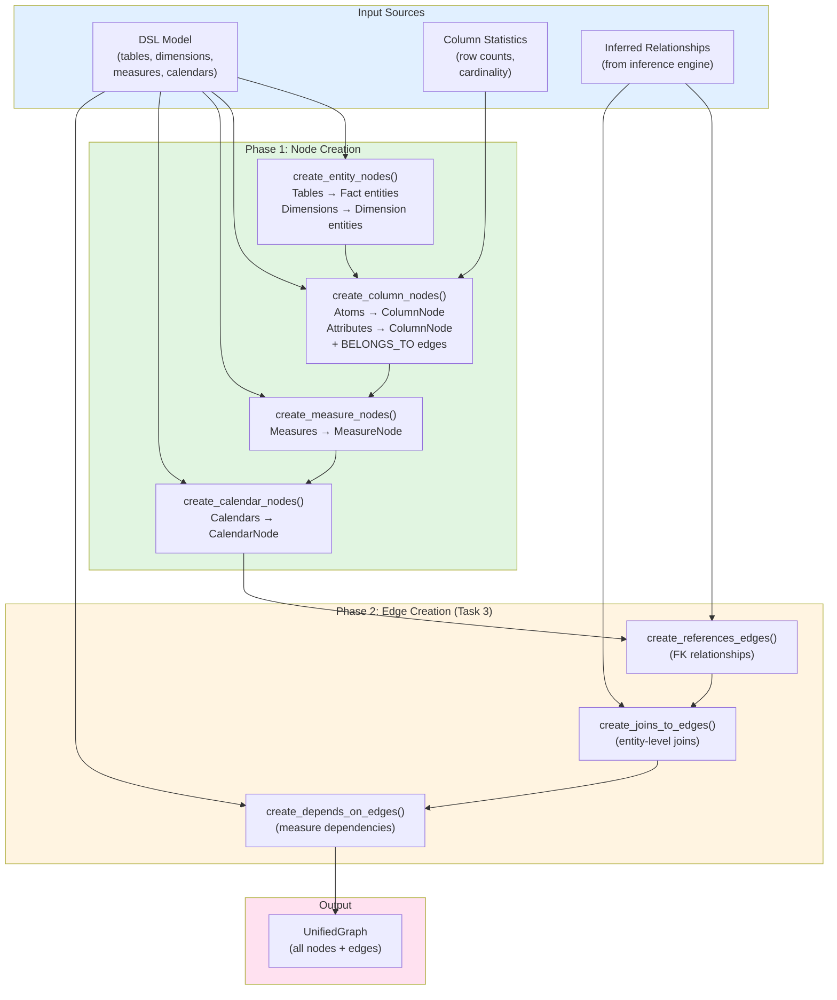

## Entity Node Creation

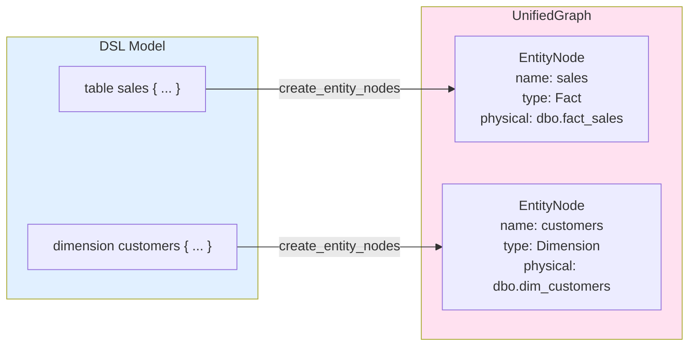

## Column Node Creation with Statistics

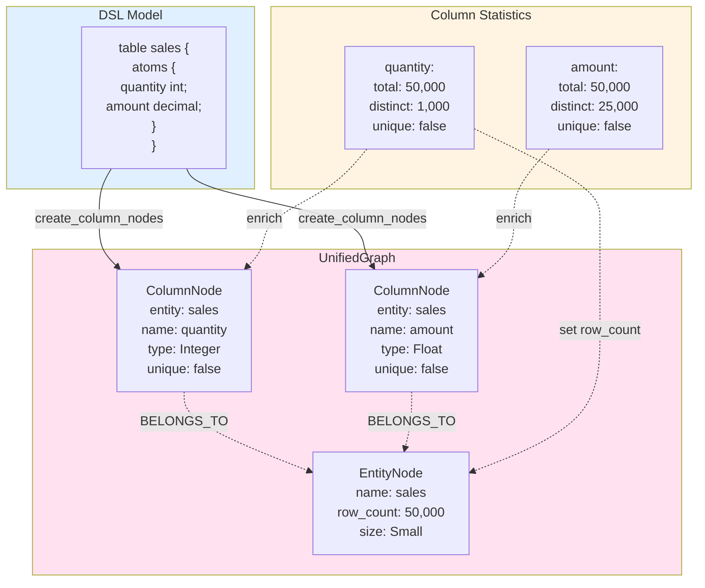

## Size Category Assignment

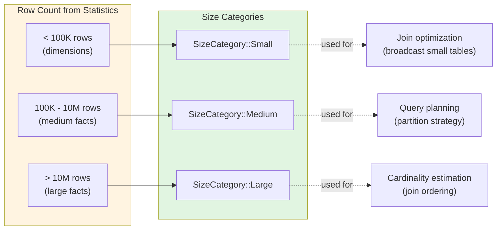

## Dimension Attribute Nodes

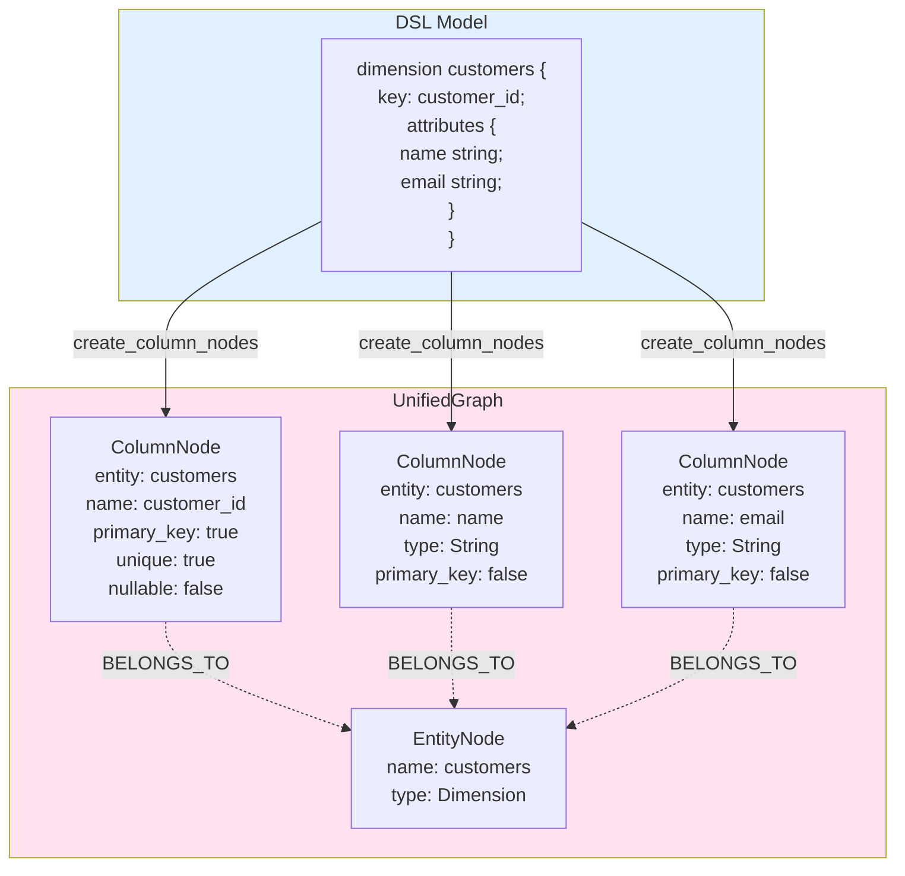

## Measure Node Creation

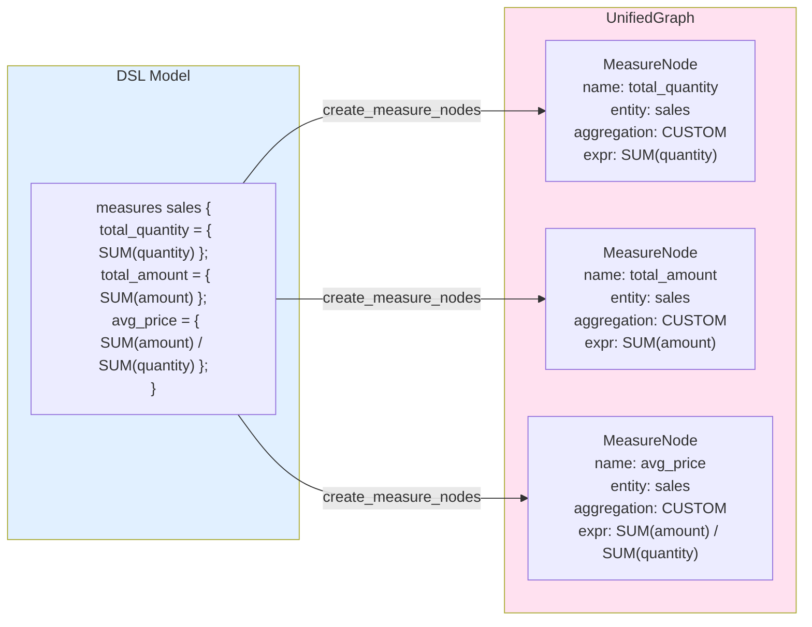

## Calendar Node Creation

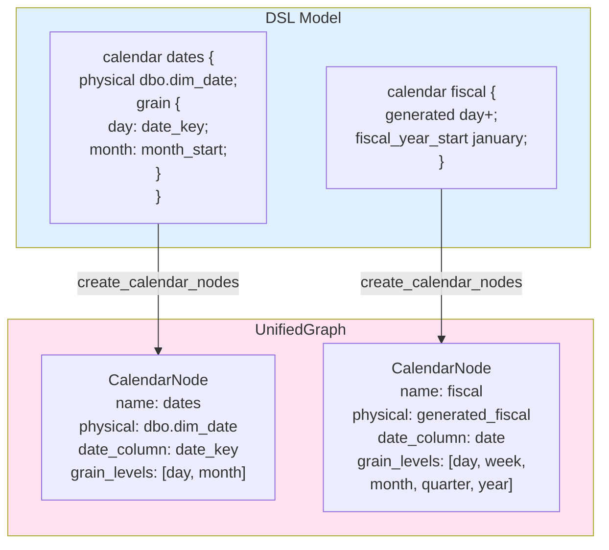

## Graph Indexes

The UnifiedGraph maintains multiple indexes for fast lookups:

```mermaid
graph TB
    subgraph Graph["UnifiedGraph"]
        PGraph["petgraph::DiGraph<br/>(nodes + edges)"]
        
        subgraph Indexes["Lookup Indexes"]
            NodeIdx["node_index<br/>String → NodeIndex<br/>(all nodes by name)"]
            EntIdx["entity_index<br/>String → NodeIndex<br/>(entities by name)"]
            ColIdx["column_index<br/>String → NodeIndex<br/>(qualified: entity.column)"]
            MeasIdx["measure_index<br/>String → NodeIndex<br/>(qualified: entity.measure)"]
            CalIdx["calendar_index<br/>String → NodeIndex<br/>(calendars by name)"]
        end
    end
    
    PGraph -.->|references| NodeIdx
    PGraph -.->|references| EntIdx
    PGraph -.->|references| ColIdx
    PGraph -.->|references| MeasIdx
    PGraph -.->|references| CalIdx
    
    NodeIdx -.->|O(1) lookup| L1["Any node by name"]
    EntIdx -.->|O(1) lookup| L2["Entity by table/dim name"]
    ColIdx -.->|O(1) lookup| L3["Column by entity.column"]
    MeasIdx -.->|O(1) lookup| L4["Measure by entity.measure"]
    CalIdx -.->|O(1) lookup| L5["Calendar by name"]
    
    style Graph fill:#ffe1f0
    style Indexes fill:#e1f5e1
```

## Complete Example

Here's a complete example showing all node types created from a sample DSL model:

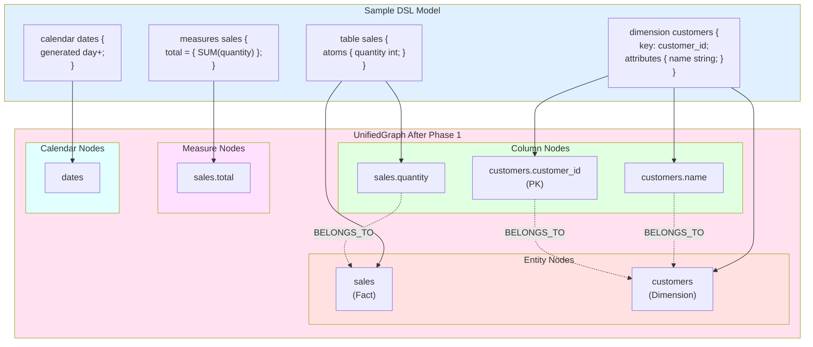

## Node Type Distribution

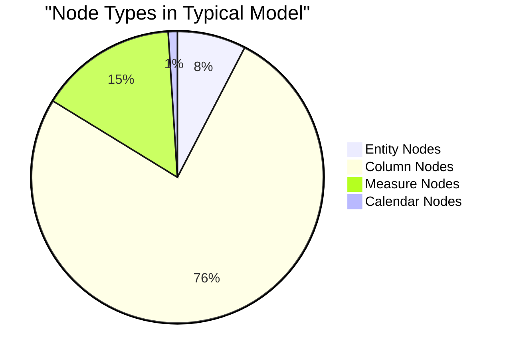

## Implementation Details

### Error Handling

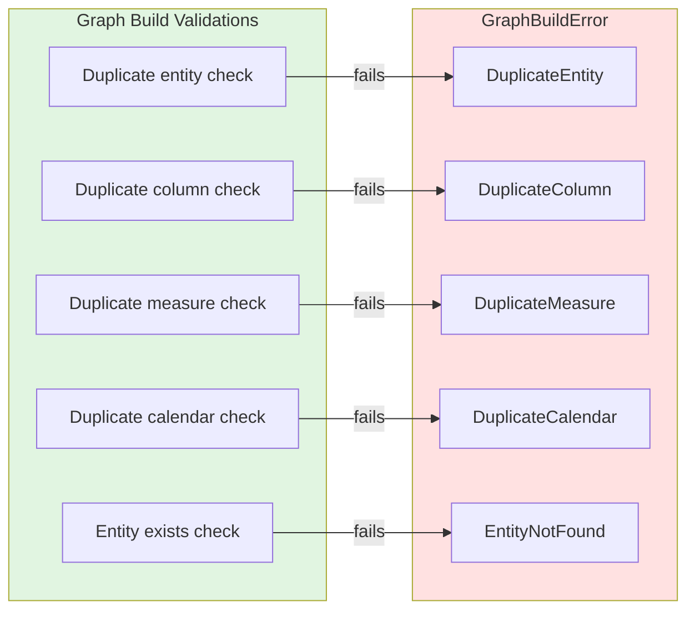

### Data Type Mapping

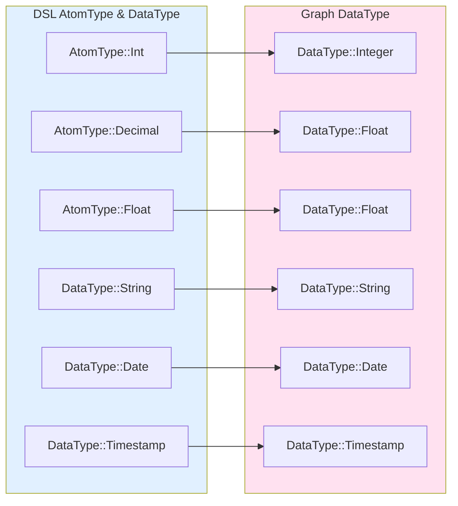

## Next Steps: Phase 2

Phase 2 (Task 3) will implement edge creation:

1. **REFERENCES edges** - FK column → PK column relationships
2. **JOINS_TO edges** - Entity-to-entity join relationships
3. **DEPENDS_ON edges** - Measure → Column dependencies

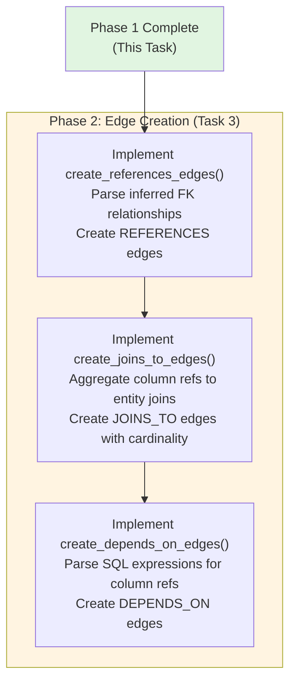
