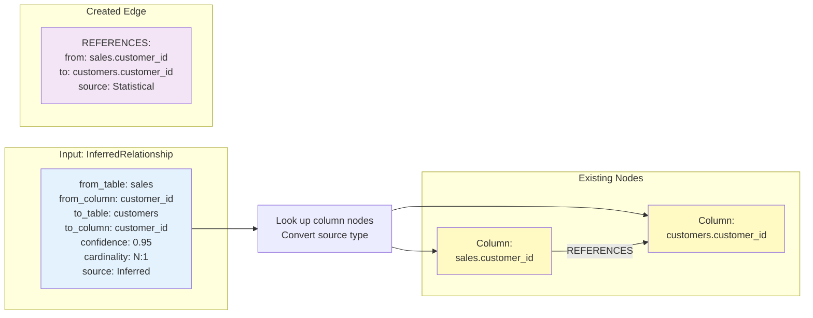
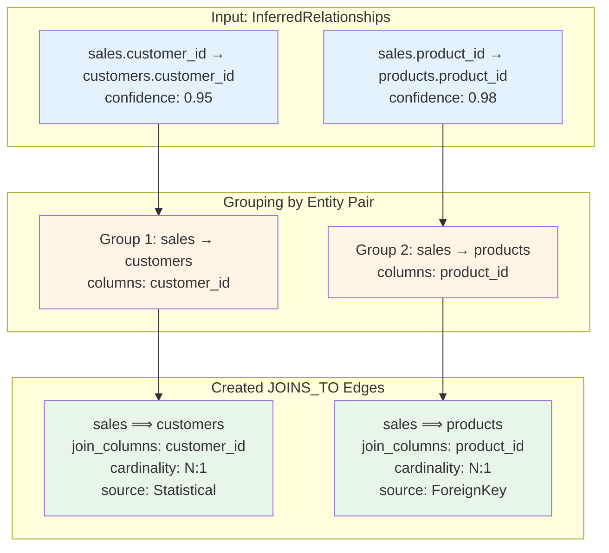

# Unified Graph Construction - Phase 2: Edge Creation

This document describes Phase 2 of the unified graph construction process, which creates edges connecting the nodes created in Phase 1.

## Overview

Phase 2 creates three types of edges that establish relationships between graph nodes:

1. **REFERENCES edges**: Column-to-column foreign key relationships
2. **JOINS_TO edges**: Entity-to-entity join relationships (aggregated from REFERENCES)
3. **DEPENDS_ON edges**: Measure-to-column dependencies (parsed from SQL expressions)

## Phase 2 Process Flow

```mermaid
graph TD
    Start[Phase 1 Complete:<br/>All nodes created] --> Input[Inputs:<br/>InferredRelationship[]<br/>Model]
    
    Input --> Step1[Step 1:<br/>create_references_edges]
    Input --> Step2[Step 2:<br/>create_joins_to_edges]
    Input --> Step3[Step 3:<br/>create_depends_on_edges]
    
    Step1 --> Complete[Phase 2 Complete:<br/>Fully connected graph]
    Step2 --> Complete
    Step3 --> Complete
    
    style Start fill:#e1f5e1
    style Complete fill:#e1f5e1
    style Step1 fill:#fff4e6
    style Step2 fill:#fff4e6
    style Step3 fill:#fff4e6
```

## Step 1: REFERENCES Edge Creation

Creates column-to-column foreign key relationships from inferred relationships.



### Algorithm

```rust
for relationship in inferred_relationships {
    // Build qualified column names
    let from_col = format!("{}.{}", relationship.from_table, relationship.from_column);
    let to_col = format!("{}.{}", relationship.to_table, relationship.to_column);
    
    // Look up column nodes
    let from_idx = column_index.get(from_col)?;
    let to_idx = column_index.get(to_col)?;
    
    // Create REFERENCES edge with converted source
    let edge = GraphEdge::References(ReferencesEdge {
        from_column: from_col,
        to_column: to_col,
        source: convert_relationship_source(relationship.source),
    });
    
    graph.add_edge(from_idx, to_idx, edge);
}
```

### Source Conversion Mapping

| Inference Source | Graph Source |
|-----------------|--------------|
| DatabaseConstraint | ForeignKey |
| Inferred | Statistical |
| UserDefined | Explicit |

## Step 2: JOINS_TO Edge Creation

Aggregates REFERENCES edges by entity pairs to create entity-level join relationships.



### Algorithm

```rust
// Group relationships by entity pair
let mut entity_joins: HashMap<(String, String), Vec<&InferredRelationship>> = HashMap::new();

for relationship in inferred_relationships {
    let key = (relationship.from_table.clone(), relationship.to_table.clone());
    entity_joins.entry(key).or_default().push(relationship);
}

// Create JOINS_TO edge for each entity pair
for ((from_entity, to_entity), relationships) in entity_joins {
    let from_idx = entity_index.get(from_entity)?;
    let to_idx = entity_index.get(to_entity)?;
    
    // Collect all join columns
    let join_columns: Vec<(String, String)> = relationships
        .iter()
        .map(|r| (r.from_column.clone(), r.to_column.clone()))
        .collect();
    
    // Use the best (highest confidence) relationship's properties
    let best_rel = relationships
        .iter()
        .max_by(|a, b| a.confidence.partial_cmp(&b.confidence).unwrap())
        .unwrap();
    
    let edge = GraphEdge::JoinsTo(JoinsToEdge {
        from_entity,
        to_entity,
        join_columns,
        cardinality: best_rel.cardinality,
        source: convert_relationship_source(best_rel.source),
    });
    
    graph.add_edge(from_idx, to_idx, edge);
}
```

### Multi-Column Join Example

```mermaid
graph LR
    subgraph "Multiple Column Relationships"
        R1[order_items.order_id → orders.order_id<br/>confidence: 0.99]
        R2[order_items.product_id → products.product_id<br/>confidence: 0.95]
    end
    
    subgraph "Single JOINS_TO Edge"
        J[order_items ⟹ orders<br/>join_columns: [order_id]<br/>cardinality: N:1<br/>confidence: 0.99]
        
        J2[order_items ⟹ products<br/>join_columns: [product_id]<br/>cardinality: N:1<br/>confidence: 0.95]
    end
    
    R1 --> J
    R2 --> J2
    
    style R1 fill:#e3f2fd
    style R2 fill:#e3f2fd
    style J fill:#c8e6c9
    style J2 fill:#c8e6c9
```

## Step 3: DEPENDS_ON Edge Creation

Parses measure SQL expressions to identify atom references and create measure-to-column dependencies.

```mermaid
graph TD
    subgraph "Input: Measure Definition"
        M[Measure: avg_price<br/>SQL: SUM(@amount) / SUM(@quantity)]
    end
    
    subgraph "Regex Pattern Matching"
        P[Pattern: @\w+<br/>Captures: @amount, @quantity]
    end
    
    subgraph "Existing Nodes"
        MN[Measure:<br/>sales.avg_price]
        C1[Column:<br/>sales.amount]
        C2[Column:<br/>sales.quantity]
    end
    
    subgraph "Created Edges"
        E1[DEPENDS_ON:<br/>measure: sales.avg_price<br/>columns: sales.amount]
        E2[DEPENDS_ON:<br/>measure: sales.avg_price<br/>columns: sales.quantity]
    end
    
    M --> P
    P --> MN
    P --> C1
    P --> C2
    MN -->|DEPENDS_ON| C1
    MN -->|DEPENDS_ON| C2
    
    style M fill:#e3f2fd
    style P fill:#fff4e6
    style MN fill:#fce4ec
    style C1 fill:#fff9c4
    style C2 fill:#fff9c4
    style E1 fill:#f3e5f5
    style E2 fill:#f3e5f5
```

### Algorithm

```rust
// Regex to match atom references: @atom_name
static ATOM_PATTERN: Lazy<Regex> = Lazy::new(|| Regex::new(r"@(\w+)").unwrap());

for measure_block in model.items {
    let entity_name = measure_block.table;
    
    for measure in measure_block.measures {
        let qualified_measure = format!("{}.{}", entity_name, measure.name);
        let measure_idx = measure_index.get(qualified_measure)?;
        
        // Parse SQL expression for atom references
        let sql = measure.expr.sql;
        
        for capture in ATOM_PATTERN.captures_iter(sql) {
            let atom_name = &capture[1];
            let qualified_col = format!("{}.{}", entity_name, atom_name);
            
            if let Some(col_idx) = column_index.get(qualified_col) {
                let edge = GraphEdge::DependsOn(DependsOnEdge {
                    measure: qualified_measure.clone(),
                    columns: vec![qualified_col],
                });
                
                graph.add_edge(measure_idx, col_idx, edge);
            }
        }
    }
}
```

### Expression Parsing Examples

```mermaid
graph TD
    subgraph "Simple Measure"
        M1[total_quantity<br/>SUM(@quantity)]
        M1 --> C1[quantity]
    end
    
    subgraph "Complex Measure"
        M2[avg_price<br/>SUM(@amount) / SUM(@quantity)]
        M2 --> C2[amount]
        M2 --> C3[quantity]
    end
    
    subgraph "Filtered Measure"
        M3[high_value_sales<br/>SUM(CASE WHEN @amount > 1000<br/>THEN @amount ELSE 0 END)]
        M3 --> C4[amount]
    end
    
    style M1 fill:#fce4ec
    style M2 fill:#fce4ec
    style M3 fill:#fce4ec
    style C1 fill:#fff9c4
    style C2 fill:#fff9c4
    style C3 fill:#fff9c4
    style C4 fill:#fff9c4
```

## Complete Phase 2 Example

Full example showing all three edge types created for a simple sales model.

```mermaid
graph TD
    subgraph "Entities"
        E1[Entity: sales<br/>type: Fact]
        E2[Entity: customers<br/>type: Dimension]
    end
    
    subgraph "Columns"
        C1[Column: sales.amount]
        C2[Column: sales.quantity]
        C3[Column: sales.customer_id]
        C4[Column: customers.customer_id]
        C5[Column: customers.name]
    end
    
    subgraph "Measures"
        M1[Measure: sales.total_amount<br/>SUM(@amount)]
        M2[Measure: sales.avg_price<br/>SUM(@amount)/SUM(@quantity)]
    end
    
    E1 -.BELONGS_TO.- C1
    E1 -.BELONGS_TO.- C2
    E1 -.BELONGS_TO.- C3
    E2 -.BELONGS_TO.- C4
    E2 -.BELONGS_TO.- C5
    
    C3 -->|REFERENCES| C4
    E1 ==>|JOINS_TO| E2
    
    M1 -.->|DEPENDS_ON| C1
    M2 -.->|DEPENDS_ON| C1
    M2 -.->|DEPENDS_ON| C2
    
    style E1 fill:#e3f2fd
    style E2 fill:#e3f2fd
    style C1 fill:#fff9c4
    style C2 fill:#fff9c4
    style C3 fill:#fff9c4
    style C4 fill:#fff9c4
    style C5 fill:#fff9c4
    style M1 fill:#fce4ec
    style M2 fill:#fce4ec
```

## Edge Type Summary

| Edge Type | Source | Target | Purpose | Metadata |
|-----------|--------|--------|---------|----------|
| **BELONGS_TO** | Column | Entity | Column ownership | column_name, entity_name |
| **REFERENCES** | Column | Column | FK relationship | from_column, to_column, source |
| **JOINS_TO** | Entity | Entity | Table-level join | join_columns[], cardinality, source |
| **DEPENDS_ON** | Measure | Column | Measure dependency | measure_name, columns[] |

## Implementation Notes

### Error Handling

All three edge creation methods return `GraphBuildResult<()>` and handle these error cases:

- **ColumnNotFound**: Referenced column doesn't exist in column_index
- **EntityNotFound**: Referenced entity doesn't exist in entity_index
- **InvalidReference**: Measure or other reference target not found

### Performance Characteristics

- **REFERENCES creation**: O(n) where n = number of inferred relationships
- **JOINS_TO creation**: O(n) for grouping + O(m) for edge creation where m = unique entity pairs
- **DEPENDS_ON creation**: O(k × p) where k = number of measures, p = regex matches per SQL expression

### Testing Strategy

Each edge creation method has dedicated unit tests:

1. **test_create_references_edges**: Validates FK edge creation with proper metadata and source conversion
2. **test_create_joins_to_edges**: Tests multi-table scenarios with multiple relationships and cardinality preservation
3. **test_create_depends_on_edges**: Verifies SQL expression parsing for single and multi-column dependencies

## Integration with Phase 1

Phase 2 relies on the indices built during Phase 1:

- `entity_index`: Maps entity name → NodeIndex
- `column_index`: Maps qualified column name (entity.column) → NodeIndex
- `measure_index`: Maps qualified measure name (entity.measure) → NodeIndex

These indices enable O(1) lookups when creating edges.

## Next Steps

After Phase 2 completion:

1. Graph traversal queries (find joins, trace dependencies)
2. Graph visualization and export
3. Query planning using graph topology
4. Impact analysis for schema changes
5. Lineage tracing from measures back to source columns
