# Unified Graph Query Interface

This document describes the query interface for the unified semantic graph, which provides methods to traverse the graph and answer questions about entity relationships, join paths, and data grain.

## Overview

The query interface implements three main capabilities:

1. **Path Finding** (`find_path`): Find the shortest join path between two entities using BFS
2. **Path Validation** (`validate_safe_path`): Check if a join path is safe (no dangerous fan-out)
3. **Grain Inference** (`infer_grain`): Determine the most granular entity in a set

## Architecture

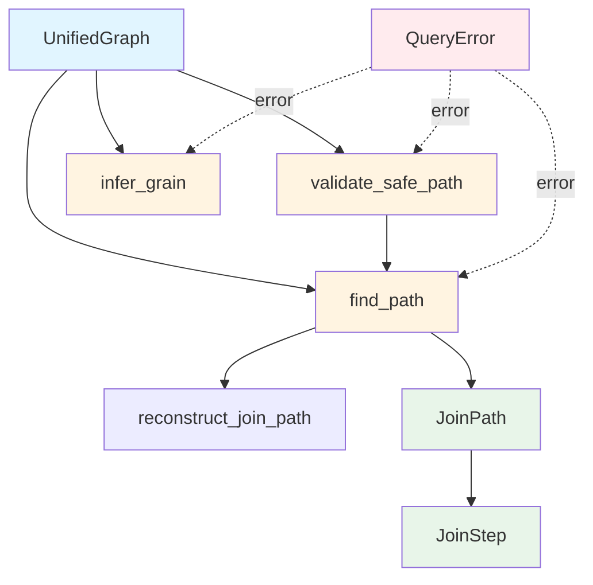

## 1. BFS Path Finding Algorithm

The `find_path` method uses Breadth-First Search (BFS) to find the shortest join path between two entities.

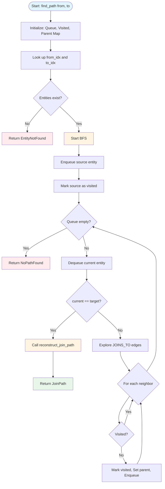

### BFS Implementation Details

```rust
// Pseudocode for find_path
fn find_path(from: &str, to: &str) -> Result<JoinPath> {
    // 1. Look up entity indices
    let from_idx = entity_index.get(from)?;
    let to_idx = entity_index.get(to)?;
    
    // 2. Initialize BFS data structures
    let mut queue = VecDeque::new();
    let mut visited = HashSet::new();
    let mut parent = HashMap::new();
    
    queue.push_back(from_idx);
    visited.insert(from_idx);
    
    // 3. BFS traversal
    while let Some(current) = queue.pop_front() {
        if current == to_idx {
            return reconstruct_join_path(from_idx, to_idx, &parent);
        }
        
        // Explore neighbors via JOINS_TO edges
        for edge in graph.edges(current) {
            if edge is JOINS_TO {
                let neighbor = edge.target();
                if !visited.contains(neighbor) {
                    visited.insert(neighbor);
                    parent.insert(neighbor, current);
                    queue.push_back(neighbor);
                }
            }
        }
    }
    
    Err(NoPathFound)
}
```

## 2. Path Reconstruction

The `reconstruct_join_path` helper walks backward from the target to the source using the parent map.

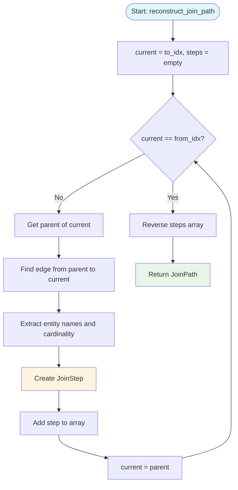

### Path Reconstruction Example

For a query `find_path("sales", "regions")` through `customers`:

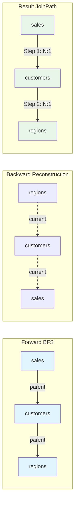

## 3. Path Validation (Safe Join Check)

The `validate_safe_path` method checks if a join path contains dangerous fan-out (OneToMany joins).

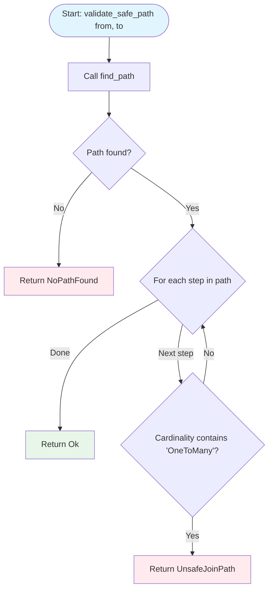

### Fan-Out Detection

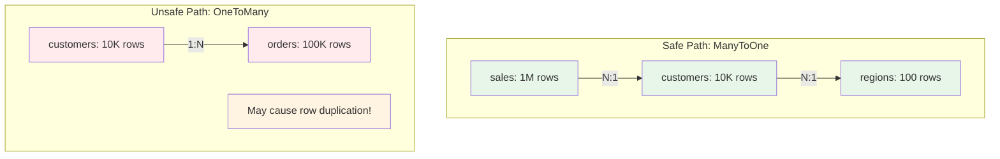

## 4. Grain Inference

The `infer_grain` method finds the entity with the highest row count (most granular).

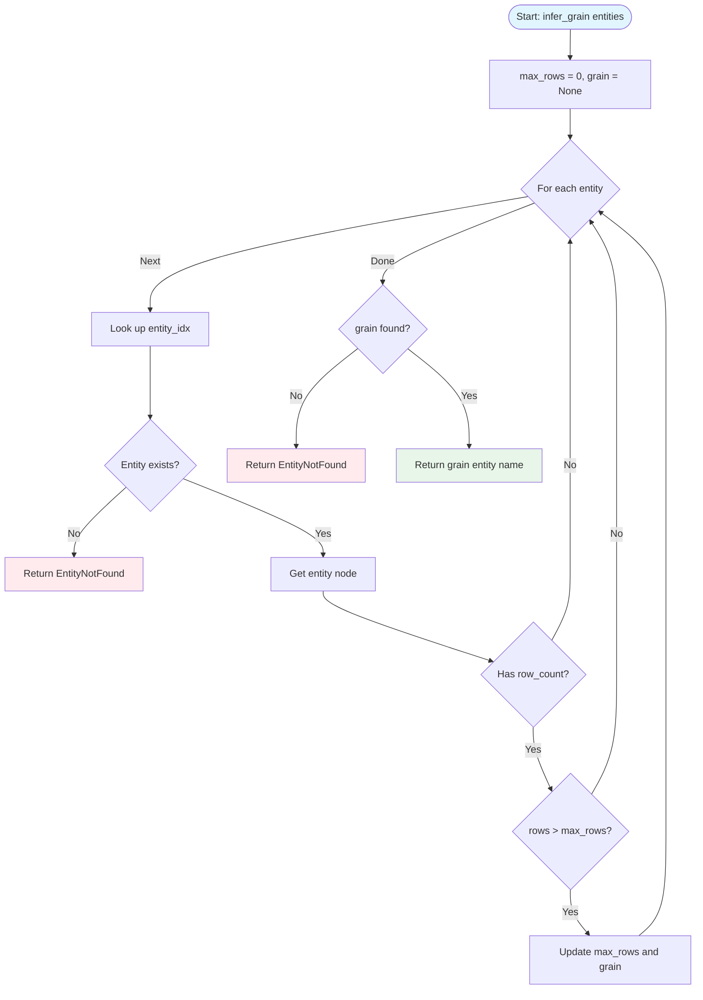

### Grain Inference Example

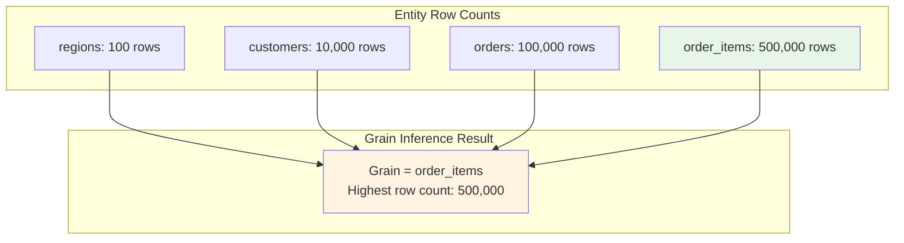

## Example Usage

### Example 1: Finding a Join Path

```rust
use crate::semantic::graph::UnifiedGraph;

let graph = UnifiedGraph::from_model_with_inference(&model, &relationships, &stats)?;

// Find path from sales to regions (through customers)
let path = graph.find_path("sales", "regions")?;

// Path has 2 steps:
// Step 1: sales -> customers (N:1)
// Step 2: customers -> regions (N:1)
assert_eq!(path.steps.len(), 2);
assert_eq!(path.steps[0].from, "sales");
assert_eq!(path.steps[0].to, "customers");
assert_eq!(path.steps[0].cardinality, "N:1");
```

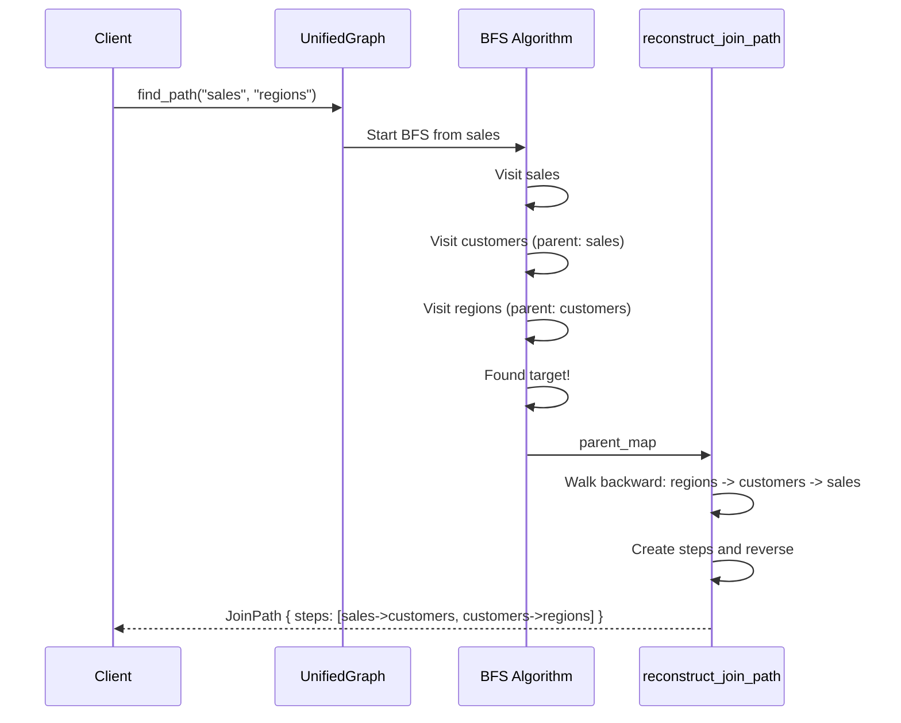

### Example 2: Validating a Safe Path

```rust
// Validate safe path (ManyToOne joins)
graph.validate_safe_path("sales", "customers")?; // OK
graph.validate_safe_path("sales", "regions")?;   // OK

// Unsafe path (OneToMany join)
let result = graph.validate_safe_path("customers", "orders");
assert!(result.is_err()); // Error: OneToMany fan-out
```

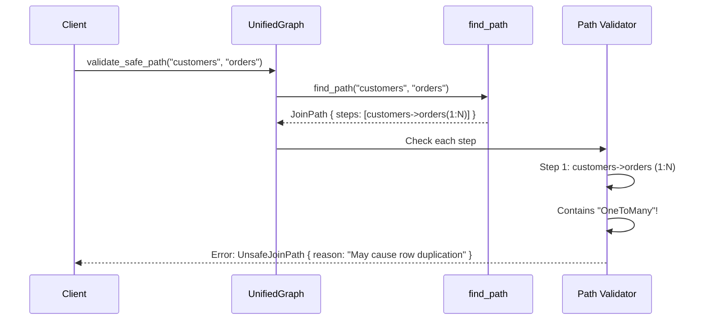

### Example 3: Inferring Grain

```rust
// Infer grain from multiple entities
let entities = &["sales", "customers", "products", "regions"];
let grain = graph.infer_grain(entities)?;

// sales has highest row count (most granular)
assert_eq!(grain, "sales");
```

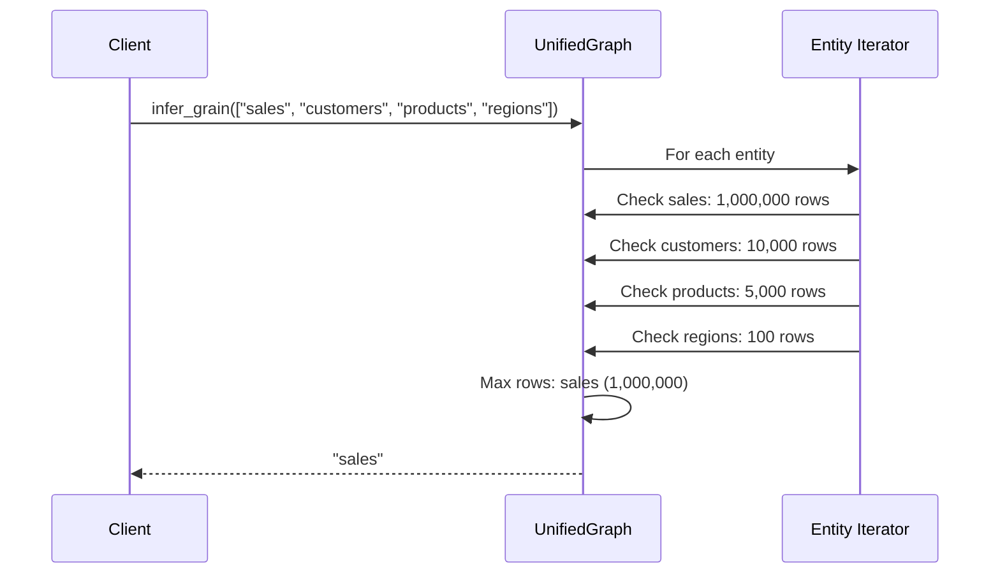

## Data Structures

### JoinPath

A complete join path between two entities.

```rust
pub struct JoinPath {
    pub steps: Vec<JoinStep>,
}
```

### JoinStep

A single step in a join path.

```rust
pub struct JoinStep {
    pub from: String,        // Source entity
    pub to: String,          // Target entity
    pub cardinality: String, // "1:1", "1:N", "N:1", "N:N"
}
```

### QueryError

Errors that can occur during queries.

```rust
pub enum QueryError {
    EntityNotFound(String),
    ColumnNotFound(String),
    MeasureNotFound(String),
    CalendarNotFound(String),
    NoPathFound { from: String, to: String },
    UnsafeJoinPath { from: String, to: String, reason: String },
}
```

## Graph Traversal Patterns

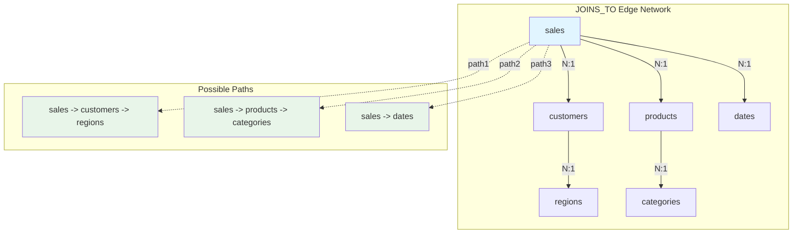

## Performance Characteristics

| Operation | Time Complexity | Space Complexity | Notes |
|-----------|----------------|------------------|-------|
| `find_path` | O(V + E) | O(V) | V = entities, E = relationships |
| `reconstruct_join_path` | O(L) | O(L) | L = path length |
| `validate_safe_path` | O(V + E + L) | O(V + L) | Includes find_path |
| `infer_grain` | O(N) | O(1) | N = number of entities |

## Error Handling

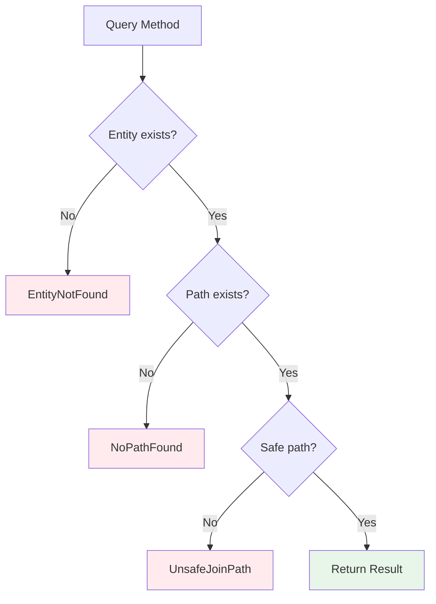

## Future Extensions

The query interface will be extended with:

1. **Column-level queries**: Trace lineage through DERIVED_FROM edges
2. **Measure queries**: Resolve measure dependencies via DEPENDS_ON edges
3. **Calendar queries**: Find time dimensions and grain levels
4. **Multi-path queries**: Find all paths (not just shortest)
5. **Cost-based routing**: Choose paths based on cardinality and row counts
6. **Circular dependency detection**: Identify cycles in derivation chains

## Related Documentation

- [Unified Graph Architecture](./unified-graph-architecture.md)
- [Graph Construction Phase 1](./unified-graph-construction-phase1.md)
- [Type System](../../src/semantic/graph/types.rs)
- [Builder Implementation](../../src/semantic/graph/builder.rs)
