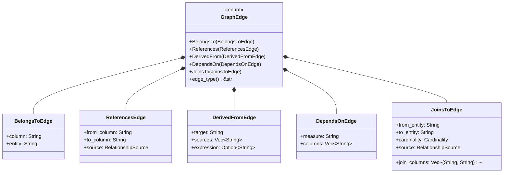

# Unified Graph Type System Architecture

This document describes the type system architecture for the unified semantic graph, which replaces the dual-graph architecture (ModelGraph + ColumnLineageGraph) with a single unified graph.

## Overview

The unified graph contains **four types of nodes** and **five types of edges**, all stored in a single `petgraph::DiGraph<GraphNode, GraphEdge>`.

## Node Types

### Node Type Hierarchy


### Supporting Enums for Nodes


## Edge Types

### Edge Type Hierarchy



### Supporting Enums for Edges


## Graph Structure

### Complete Graph Schema


### Example Graph Instance


## UnifiedGraph Structure


## Design Principles

### 1. Single Source of Truth
- All semantic elements (entities, columns, measures, calendars) are nodes in one graph
- No separate graphs for different concerns
- Relationships are explicit edges with typed metadata

### 2. Typed Edges
Each edge type has a specific purpose:
- **BELONGS_TO**: Structural ownership (column → entity)
- **REFERENCES**: Foreign key relationships (column → column)
- **DERIVED_FROM**: Column lineage (column → column(s))
- **DEPENDS_ON**: Measure dependencies (measure → column(s))
- **JOINS_TO**: Table-level joins (entity → entity)

### 3. Rich Metadata
- Every node and edge can carry custom metadata
- Provenance tracking via `RelationshipSource`
- Size categories for query optimization
- Data types for validation

### 4. Indexing Strategy
Multiple indices for efficient lookups:
- `node_index`: Universal name → NodeIndex
- `entity_index`: Entity-specific lookups
- `column_index`: Qualified column names (entity.column)
- `measure_index`: Qualified measure names (entity.measure)
- `calendar_index`: Calendar-specific lookups

## Migration from Dual-Graph Architecture

### Old Architecture
```
ModelGraph (entities + relationships)
      +
ColumnLineageGraph (columns + transformations)
```

### New Architecture
```
UnifiedGraph (entities + columns + measures + calendars + all relationships)
```

### Benefits
1. **Simpler mental model**: One graph, not two
2. **Easier queries**: No cross-graph coordination
3. **Better lineage**: Full path from measure → column → entity
4. **Extensible**: Add new node/edge types without creating new graphs

## Type Safety

All node and edge types are strongly typed Rust enums:
- Compile-time guarantees about graph structure
- Pattern matching for exhaustive edge handling
- No runtime type confusion
- Clear API surface

## Next Steps

1. **Task 2**: Implement builder methods to populate the graph
2. **Task 3**: Add graph query methods (find_path, get_lineage, etc.)
3. **Task 4**: Implement conversion from DSL Model → UnifiedGraph
4. **Task 5**: Add serialization/deserialization support
