# Unified Graph Rebuild Implementation Plan

> **For Claude:** REQUIRED SUB-SKILL: Use superpowers:executing-plans to implement this plan task-by-task.

**Goal:** Replace ModelGraph with UnifiedGraph - a column-level graph that integrates inference metadata for optimal SQL generation.

**Architecture:** Single unified graph with entities, columns, measures, and calendars as first-class nodes. Typed edges (BELONGS_TO, REFERENCES, DERIVED_FROM, DEPENDS_ON, JOINS_TO) connect nodes. Inference metadata (cardinality, selectivity, uniqueness, size categories) wired in at construction time.

**Tech Stack:** 
- petgraph (DiGraph)
- Existing inference module (src/semantic/inference)
- New DSL types (src/model)

**Key Decisions:**
1. Build fresh under `src/semantic/graph/` (clean slate)
2. Construction-time inference (caller runs inference first, passes results)
3. Clean break (replace ModelGraph completely, update all consumers)
4. Column-level graph (entities are nodes, not containers)

---

## Task 1: Create Type Definitions

**Files:**
- Create: `src/semantic/graph/mod.rs`
- Create: `src/semantic/graph/types.rs`

**Step 1: Write the module declaration**

Add to `src/semantic/mod.rs`:
```rust
pub mod graph;
```

**Step 2: Create types.rs with supporting enums**

Create `src/semantic/graph/types.rs`:
```rust
use crate::model::Cardinality as ModelCardinality;
use crate::semantic::inference::RelationshipSource;
use serde::{Deserialize, Serialize};

/// Size category for entity optimization hints
#[derive(Debug, Clone, Copy, PartialEq, Eq, Serialize, Deserialize)]
pub enum SizeCategory {
    Tiny,      // < 1K rows
    Small,     // < 100K rows
    Medium,    // < 1M rows
    Large,     // < 10M rows
    Huge,      // >= 10M rows
}

impl SizeCategory {
    pub fn from_row_count(rows: u64) -> Self {
        match rows {
            0..=1_000 => SizeCategory::Tiny,
            1_001..=100_000 => SizeCategory::Small,
            100_001..=1_000_000 => SizeCategory::Medium,
            1_000_001..=10_000_000 => SizeCategory::Large,
            _ => SizeCategory::Huge,
        }
    }
}

/// Entity type in the unified graph
#[derive(Debug, Clone, Copy, PartialEq, Eq, Serialize, Deserialize)]
pub enum EntityType {
    Table,      // Regular table from DSL
    Dimension,  // Dimension table
}

/// Cardinality of relationships (re-exported for clarity)
#[derive(Debug, Clone, Copy, PartialEq, Eq, Serialize, Deserialize)]
pub enum Cardinality {
    OneToOne,
    OneToMany,
    ManyToOne,
    ManyToMany,
}

impl From<ModelCardinality> for Cardinality {
    fn from(c: ModelCardinality) -> Self {
        match c {
            ModelCardinality::OneToOne => Cardinality::OneToOne,
            ModelCardinality::OneToMany => Cardinality::OneToMany,
            ModelCardinality::ManyToOne => Cardinality::ManyToOne,
            ModelCardinality::ManyToMany => Cardinality::ManyToMany,
        }
    }
}

/// Data type for columns
#[derive(Debug, Clone, PartialEq, Eq, Serialize, Deserialize)]
pub enum DataType {
    Integer,
    Float,
    String,
    Boolean,
    Date,
    Timestamp,
    Decimal { precision: u8, scale: u8 },
    Unknown,
}
```

**Step 3: Add node type definitions**

Continue in `types.rs`:
```rust
/// Entity node in the unified graph
#[derive(Debug, Clone, Serialize, Deserialize)]
pub struct EntityNode {
    pub id: String,
    pub name: String,
    pub physical_name: String,
    pub entity_type: EntityType,
    pub estimated_rows: Option<u64>,
    pub size_category: Option<SizeCategory>,
}

/// Column node in the unified graph
#[derive(Debug, Clone, Serialize, Deserialize)]
pub struct ColumnNode {
    pub id: String,
    pub entity_id: String,
    pub name: String,
    pub physical_name: String,
    pub data_type: DataType,
    pub nullable: bool,
    pub is_unique: bool,
    pub high_cardinality: bool,
    pub is_primary_key: bool,
    pub is_indexed: bool,
}

/// Measure node in the unified graph
#[derive(Debug, Clone, Serialize, Deserialize)]
pub struct MeasureNode {
    pub id: String,
    pub name: String,
    pub grain_entity: String,
    pub aggregation_type: String,
    pub expression_sql: String, // TODO: Replace with Expr AST when parser ready
}

/// Calendar node in the unified graph
#[derive(Debug, Clone, Serialize, Deserialize)]
pub struct CalendarNode {
    pub id: String,
    pub name: String,
    pub grain: String,
}
```

**Step 4: Add edge type definitions**

Continue in `types.rs`:
```rust
/// Column belongs to entity
#[derive(Debug, Clone, Serialize, Deserialize)]
pub struct BelongsToEdge {
    pub column_id: String,
    pub entity_id: String,
}

/// Column references column (FK relationship)
#[derive(Debug, Clone, Serialize, Deserialize)]
pub struct ReferencesEdge {
    pub from_column_id: String,
    pub to_column_id: String,
    pub cardinality: Cardinality,
    pub selectivity: f32,
    pub enforced: bool,
    pub confidence: f32,
    pub source: RelationshipSource,
}

/// Column derived from other columns (calculated)
#[derive(Debug, Clone, Serialize, Deserialize)]
pub struct DerivedFromEdge {
    pub from_column_id: String,
    pub to_column_id: String,
}

/// Measure depends on columns
#[derive(Debug, Clone, Serialize, Deserialize)]
pub struct DependsOnEdge {
    pub measure_id: String,
    pub column_id: String,
}

/// Entity joins to entity (aggregated from REFERENCES)
#[derive(Debug, Clone, Serialize, Deserialize)]
pub struct JoinsToEdge {
    pub from_entity_id: String,
    pub to_entity_id: String,
    pub from_column_id: String,
    pub to_column_id: String,
    pub cardinality: Cardinality,
    pub selectivity: f32,
    pub confidence: f32,
}
```

**Step 5: Add unified enums**

Continue in `types.rs`:
```rust
/// Unified node type
#[derive(Debug, Clone, Serialize, Deserialize)]
pub enum GraphNode {
    Entity(EntityNode),
    Column(ColumnNode),
    Measure(MeasureNode),
    Calendar(CalendarNode),
}

/// Unified edge type
#[derive(Debug, Clone, Serialize, Deserialize)]
pub enum GraphEdge {
    BelongsTo(BelongsToEdge),
    References(ReferencesEdge),
    DerivedFrom(DerivedFromEdge),
    DependsOn(DependsOnEdge),
    JoinsTo(JoinsToEdge),
}
```

**Step 6: Create mod.rs skeleton**

Create `src/semantic/graph/mod.rs`:
```rust
//! Unified graph representation for semantic layer.
//!
//! This module provides a column-level graph that integrates inference metadata
//! for optimal SQL generation. It replaces the old ModelGraph + ColumnLineageGraph split.

pub mod types;

use petgraph::graph::{DiGraph, NodeIndex};
use std::collections::HashMap;
use types::*;

/// Unified graph with entities, columns, measures, calendars as nodes
pub struct UnifiedGraph {
    graph: DiGraph<GraphNode, GraphEdge>,
    
    // Lookup indices
    node_index: HashMap<String, NodeIndex>,
    entities: HashMap<String, NodeIndex>,
    columns: HashMap<String, NodeIndex>,
    measures: HashMap<String, NodeIndex>,
    calendars: HashMap<String, NodeIndex>,
}

impl UnifiedGraph {
    /// Create a new empty graph
    pub fn new() -> Self {
        Self {
            graph: DiGraph::new(),
            node_index: HashMap::new(),
            entities: HashMap::new(),
            columns: HashMap::new(),
            measures: HashMap::new(),
            calendars: HashMap::new(),
        }
    }
}

impl Default for UnifiedGraph {
    fn default() -> Self {
        Self::new()
    }
}
```

**Step 7: Compile to verify types**

Run: `cargo check --lib`
Expected: SUCCESS (no errors)

**Step 8: Commit types**

```bash
git add src/semantic/mod.rs src/semantic/graph/
git commit -m "feat(graph): add unified graph type definitions"
```

**Step 9: Create architecture diagram for type system**

Create `docs/diagrams/unified-graph-types.md`:

````markdown
# Unified Graph Type System

## Node Types

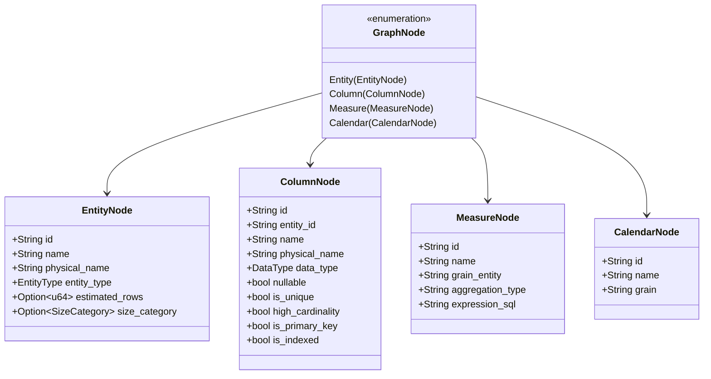

## Edge Types

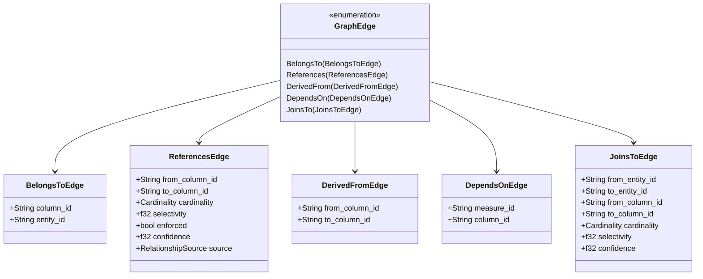

## Metadata Integration

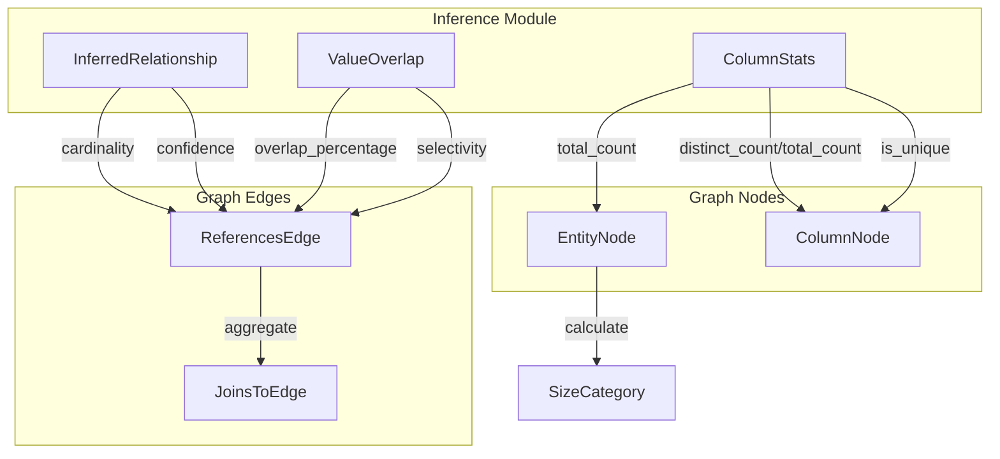
````

Expected: Professional diagram documentation ready for troubleshooting

**Step 10: Commit diagram**

```bash
git add docs/diagrams/unified-graph-types.md
git commit -m "docs(graph): add type system architecture diagram"
```

---

## Task 2: Implement Graph Construction (Phase 1 - Nodes)

**Files:**
- Modify: `src/semantic/graph/mod.rs`
- Create: `src/semantic/graph/builder.rs`

**Step 1: Add builder module**

Add to `src/semantic/graph/mod.rs`:
```rust
mod builder;
```

**Step 2: Create builder.rs with construction signature**

Create `src/semantic/graph/builder.rs`:
```rust
use super::types::*;
use super::UnifiedGraph;
use crate::metadata::types::ColumnStats;
use crate::model::Model;
use crate::semantic::inference::InferredRelationship;
use std::collections::HashMap;

/// Error during graph construction
#[derive(Debug, thiserror::Error)]
pub enum GraphBuildError {
    #[error("Duplicate node ID: {0}")]
    DuplicateNodeId(String),
    
    #[error("Entity not found: {0}")]
    EntityNotFound(String),
    
    #[error("Column not found: {0}")]
    ColumnNotFound(String),
    
    #[error("Invalid reference: {0}")]
    InvalidReference(String),
}

pub type GraphBuildResult<T> = Result<T, GraphBuildError>;

impl UnifiedGraph {
    /// Construct graph from Model and inference results
    pub fn from_model_with_inference(
        model: &Model,
        relationships: &[InferredRelationship],
        stats: &HashMap<(String, String), ColumnStats>,
    ) -> GraphBuildResult<Self> {
        let mut graph = Self::new();
        
        // Phase 1: Create nodes
        graph.create_entity_nodes(model)?;
        graph.create_column_nodes(model, stats)?;
        graph.create_measure_nodes(model)?;
        graph.create_calendar_nodes(model)?;
        
        // Phase 2: Create edges
        graph.create_references_edges(relationships)?;
        graph.create_joins_to_edges()?;
        graph.create_depends_on_edges(model)?;
        
        Ok(graph)
    }
}
```

**Step 3: Implement create_entity_nodes**

Add to `builder.rs`:
```rust
impl UnifiedGraph {
    pub(crate) fn create_entity_nodes(&mut self, model: &Model) -> GraphBuildResult<()> {
        for (table_name, table) in &model.tables {
            let entity_id = format!("entity:{}", table_name);
            
            let node = GraphNode::Entity(EntityNode {
                id: entity_id.clone(),
                name: table_name.clone(),
                physical_name: table.source.clone(),
                entity_type: EntityType::Table,
                estimated_rows: None, // Will be enriched from stats
                size_category: None,  // Will be enriched from stats
            });
            
            let node_idx = self.graph.add_node(node);
            self.node_index.insert(entity_id.clone(), node_idx);
            self.entities.insert(table_name.clone(), node_idx);
        }
        
        // Also create entity nodes for dimensions
        for (dim_name, dimension) in &model.dimensions {
            let entity_id = format!("entity:{}", dim_name);
            
            let node = GraphNode::Entity(EntityNode {
                id: entity_id.clone(),
                name: dim_name.clone(),
                physical_name: dimension.source.table.clone(),
                entity_type: EntityType::Dimension,
                estimated_rows: None,
                size_category: None,
            });
            
            let node_idx = self.graph.add_node(node);
            self.node_index.insert(entity_id.clone(), node_idx);
            self.entities.insert(dim_name.clone(), node_idx);
        }
        
        Ok(())
    }
}
```

**Step 4: Implement create_column_nodes**

Add to `builder.rs`:
```rust
impl UnifiedGraph {
    pub(crate) fn create_column_nodes(
        &mut self,
        model: &Model,
        stats: &HashMap<(String, String), ColumnStats>,
    ) -> GraphBuildResult<()> {
        use petgraph::Direction;
        
        // Create columns for tables
        for (table_name, table) in &model.tables {
            let entity_idx = *self.entities.get(table_name)
                .ok_or_else(|| GraphBuildError::EntityNotFound(table_name.clone()))?;
            
            // Create columns from atoms
            for (atom_name, atom) in &table.atoms {
                let column_id = format!("column:{}:{}", table_name, atom_name);
                
                // Get stats for this column
                let column_stats = stats.get(&(table.source.clone(), atom.column.clone()));
                
                let is_unique = column_stats.map(|s| s.is_unique).unwrap_or(false);
                let high_cardinality = column_stats.map(|s| {
                    if s.total_count > 0 {
                        (s.distinct_count as f64 / s.total_count as f64) > 0.8
                    } else {
                        false
                    }
                }).unwrap_or(false);
                
                let node = GraphNode::Column(ColumnNode {
                    id: column_id.clone(),
                    entity_id: format!("entity:{}", table_name),
                    name: atom_name.clone(),
                    physical_name: atom.column.clone(),
                    data_type: DataType::Unknown, // TODO: Get from metadata
                    nullable: true, // TODO: Get from metadata
                    is_unique,
                    high_cardinality,
                    is_primary_key: false, // TODO: Detect from metadata
                    is_indexed: false, // TODO: Get from metadata
                });
                
                let node_idx = self.graph.add_node(node);
                self.node_index.insert(column_id.clone(), node_idx);
                self.columns.insert(column_id.clone(), node_idx);
                
                // Create BELONGS_TO edge
                let edge = GraphEdge::BelongsTo(BelongsToEdge {
                    column_id: column_id.clone(),
                    entity_id: format!("entity:{}", table_name),
                });
                self.graph.add_edge(node_idx, entity_idx, edge);
            }
            
            // Enrich entity with row count from stats
            if let Some(first_atom) = table.atoms.values().next() {
                if let Some(col_stats) = stats.get(&(table.source.clone(), first_atom.column.clone())) {
                    if let GraphNode::Entity(entity_node) = &mut self.graph[entity_idx] {
                        entity_node.estimated_rows = Some(col_stats.total_count as u64);
                        entity_node.size_category = Some(SizeCategory::from_row_count(col_stats.total_count as u64));
                    }
                }
            }
        }
        
        Ok(())
    }
}
```

**Step 5: Implement create_measure_nodes**

Add to `builder.rs`:
```rust
impl UnifiedGraph {
    pub(crate) fn create_measure_nodes(&mut self, model: &Model) -> GraphBuildResult<()> {
        for (measure_block_name, measure_block) in &model.measures {
            for (measure_name, measure) in &measure_block.measures {
                let measure_id = format!("measure:{}:{}", measure_block_name, measure_name);
                
                let node = GraphNode::Measure(MeasureNode {
                    id: measure_id.clone(),
                    name: measure_name.clone(),
                    grain_entity: measure_block_name.clone(),
                    aggregation_type: measure.aggregation.to_string(),
                    expression_sql: measure.expression.clone(),
                });
                
                let node_idx = self.graph.add_node(node);
                self.node_index.insert(measure_id.clone(), node_idx);
                self.measures.insert(measure_id.clone(), node_idx);
            }
        }
        
        Ok(())
    }
}
```

**Step 6: Implement create_calendar_nodes**

Add to `builder.rs`:
```rust
impl UnifiedGraph {
    pub(crate) fn create_calendar_nodes(&mut self, model: &Model) -> GraphBuildResult<()> {
        for (calendar_name, calendar) in &model.calendars {
            let calendar_id = format!("calendar:{}", calendar_name);
            
            let node = GraphNode::Calendar(CalendarNode {
                id: calendar_id.clone(),
                name: calendar_name.clone(),
                grain: calendar.grain.clone(),
            });
            
            let node_idx = self.graph.add_node(node);
            self.node_index.insert(calendar_id.clone(), node_idx);
            self.calendars.insert(calendar_name.clone(), node_idx);
        }
        
        Ok(())
    }
}
```

**Step 7: Export builder module**

Add to `src/semantic/graph/mod.rs`:
```rust
pub use builder::{GraphBuildError, GraphBuildResult};
```

**Step 8: Compile to verify Phase 1**

Run: `cargo check --lib`
Expected: SUCCESS (may have warnings about unused imports)

**Step 9: Write unit test for node creation**

Create `src/semantic/graph/tests.rs`:
```rust
#[cfg(test)]
mod tests {
    use super::*;
    use crate::model::{Model, Table, Atom, MeasureBlock, Measure};
    use std::collections::HashMap;
    
    #[test]
    fn test_create_entity_nodes() {
        let mut model = Model::default();
        
        // Add a simple table
        let mut table = Table::default();
        table.source = "raw_sales".to_string();
        model.tables.insert("sales".to_string(), table);
        
        let graph = UnifiedGraph::from_model_with_inference(
            &model,
            &[],
            &HashMap::new(),
        ).unwrap();
        
        assert_eq!(graph.entities.len(), 1);
        assert!(graph.entities.contains_key("sales"));
    }
    
    #[test]
    fn test_create_column_nodes() {
        let mut model = Model::default();
        
        let mut table = Table::default();
        table.source = "raw_sales".to_string();
        
        let mut atom = Atom::default();
        atom.column = "customer_id".to_string();
        table.atoms.insert("customer_id".to_string(), atom);
        
        model.tables.insert("sales".to_string(), table);
        
        let graph = UnifiedGraph::from_model_with_inference(
            &model,
            &[],
            &HashMap::new(),
        ).unwrap();
        
        assert_eq!(graph.columns.len(), 1);
        assert!(graph.columns.contains_key("column:sales:customer_id"));
    }
}
```

Add to `src/semantic/graph/mod.rs`:
```rust
#[cfg(test)]
mod tests;
```

**Step 10: Run tests**

Run: `cargo test --lib semantic::graph::tests`
Expected: PASS

**Step 11: Commit Phase 1**

```bash
git add src/semantic/graph/
git commit -m "feat(graph): implement node creation (entities, columns, measures, calendars)"
```

**Step 12: Create architecture diagram for Phase 1**

Create `docs/diagrams/unified-graph-construction-phase1.md`:

````markdown
# Unified Graph Construction - Phase 1 (Nodes)

## Node Creation Flow

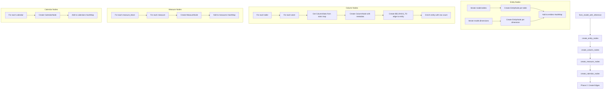

## Metadata Enrichment

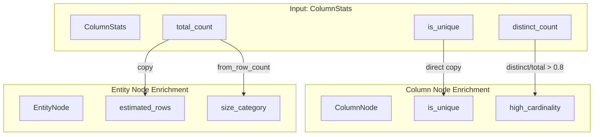

## Graph Structure After Phase 1

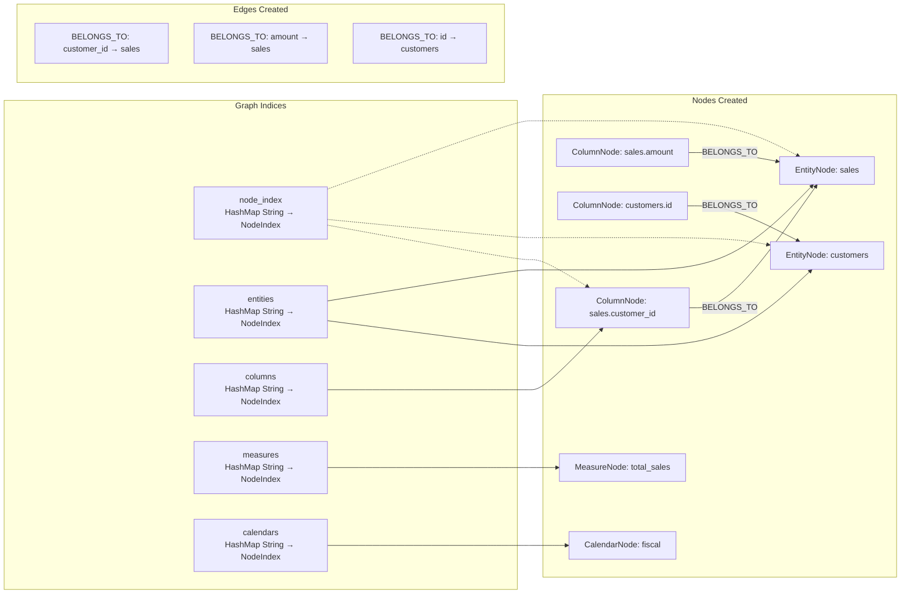
````

Expected: Clear visualization of Phase 1 construction

**Step 13: Commit diagram**

```bash
git add docs/diagrams/unified-graph-construction-phase1.md
git commit -m "docs(graph): add Phase 1 construction diagram"
```

---

## Task 3: Implement Graph Construction (Phase 2 - Edges)

**Files:**
- Modify: `src/semantic/graph/builder.rs`

**Step 1: Implement create_references_edges**

Add to `builder.rs`:
```rust
impl UnifiedGraph {
    pub(crate) fn create_references_edges(
        &mut self,
        relationships: &[InferredRelationship],
    ) -> GraphBuildResult<()> {
        use petgraph::Direction;
        
        for rel in relationships {
            // Find source column node
            let from_column_id = format!("column:{}:{}", rel.from_table, rel.from_column);
            let from_idx = self.columns.get(&from_column_id)
                .ok_or_else(|| GraphBuildError::ColumnNotFound(from_column_id.clone()))?;
            
            // Find target column node
            let to_column_id = format!("column:{}:{}", rel.to_table, rel.to_column);
            let to_idx = self.columns.get(&to_column_id)
                .ok_or_else(|| GraphBuildError::ColumnNotFound(to_column_id.clone()))?;
            
            // Create REFERENCES edge with metadata
            let edge = GraphEdge::References(ReferencesEdge {
                from_column_id: from_column_id.clone(),
                to_column_id: to_column_id.clone(),
                cardinality: rel.cardinality.into(),
                selectivity: 1.0, // TODO: Calculate from overlap
                enforced: matches!(rel.source, crate::semantic::inference::RelationshipSource::DatabaseConstraint),
                confidence: rel.confidence as f32,
                source: rel.source,
            });
            
            self.graph.add_edge(*from_idx, *to_idx, edge);
        }
        
        Ok(())
    }
}
```

**Step 2: Implement create_joins_to_edges**

Add to `builder.rs`:
```rust
impl UnifiedGraph {
    pub(crate) fn create_joins_to_edges(&mut self) -> GraphBuildResult<()> {
        use petgraph::Direction;
        use std::collections::HashSet;
        
        // Collect all REFERENCES edges and aggregate to entity level
        let mut entity_joins: HashMap<(String, String), Vec<ReferencesEdge>> = HashMap::new();
        
        for edge_idx in self.graph.edge_indices() {
            if let GraphEdge::References(ref_edge) = &self.graph[edge_idx] {
                // Extract entity IDs from column IDs
                let from_parts: Vec<&str> = ref_edge.from_column_id.split(':').collect();
                let to_parts: Vec<&str> = ref_edge.to_column_id.split(':').collect();
                
                if from_parts.len() >= 3 && to_parts.len() >= 3 {
                    let from_entity = from_parts[1].to_string();
                    let to_entity = to_parts[1].to_string();
                    let key = (from_entity.clone(), to_entity.clone());
                    
                    entity_joins.entry(key).or_default().push(ref_edge.clone());
                }
            }
        }
        
        // Create JOINS_TO edges
        for ((from_entity, to_entity), references) in entity_joins {
            let from_entity_id = format!("entity:{}", from_entity);
            let to_entity_id = format!("entity:{}", to_entity);
            
            let from_idx = self.entities.get(&from_entity)
                .ok_or_else(|| GraphBuildError::EntityNotFound(from_entity.clone()))?;
            let to_idx = self.entities.get(&to_entity)
                .ok_or_else(|| GraphBuildError::EntityNotFound(to_entity.clone()))?;
            
            // Use the first (highest confidence) reference for the join
            if let Some(best_ref) = references.first() {
                let edge = GraphEdge::JoinsTo(JoinsToEdge {
                    from_entity_id,
                    to_entity_id,
                    from_column_id: best_ref.from_column_id.clone(),
                    to_column_id: best_ref.to_column_id.clone(),
                    cardinality: best_ref.cardinality,
                    selectivity: best_ref.selectivity,
                    confidence: best_ref.confidence,
                });
                
                self.graph.add_edge(*from_idx, *to_idx, edge);
            }
        }
        
        Ok(())
    }
}
```

**Step 3: Implement create_depends_on_edges**

Add to `builder.rs`:
```rust
impl UnifiedGraph {
    pub(crate) fn create_depends_on_edges(&mut self, model: &Model) -> GraphBuildResult<()> {
        use regex::Regex;
        use once_cell::sync::Lazy;
        
        static ATOM_PATTERN: Lazy<Regex> = Lazy::new(|| Regex::new(r"@(\w+)").unwrap());
        
        for (measure_block_name, measure_block) in &model.measures {
            for (measure_name, measure) in &measure_block.measures {
                let measure_id = format!("measure:{}:{}", measure_block_name, measure_name);
                let measure_idx = self.measures.get(&measure_id)
                    .ok_or_else(|| GraphBuildError::InvalidReference(measure_id.clone()))?;
                
                // Extract @atom references from expression
                for cap in ATOM_PATTERN.captures_iter(&measure.expression) {
                    let atom_name = &cap[1];
                    let column_id = format!("column:{}:{}", measure_block_name, atom_name);
                    
                    if let Some(column_idx) = self.columns.get(&column_id) {
                        let edge = GraphEdge::DependsOn(DependsOnEdge {
                            measure_id: measure_id.clone(),
                            column_id: column_id.clone(),
                        });
                        
                        self.graph.add_edge(*measure_idx, *column_idx, edge);
                    }
                }
            }
        }
        
        Ok(())
    }
}
```

**Step 4: Compile to verify Phase 2**

Run: `cargo check --lib`
Expected: SUCCESS

**Step 5: Write unit test for edge creation**

Add to `src/semantic/graph/tests.rs`:
```rust
#[test]
fn test_create_references_edges() {
    use crate::semantic::inference::{InferredRelationship, RelationshipSource};
    use crate::model::Cardinality;
    
    let mut model = Model::default();
    
    // Create sales table with customer_id
    let mut sales_table = Table::default();
    sales_table.source = "raw_sales".to_string();
    let mut customer_id_atom = Atom::default();
    customer_id_atom.column = "customer_id".to_string();
    sales_table.atoms.insert("customer_id".to_string(), customer_id_atom);
    model.tables.insert("sales".to_string(), sales_table);
    
    // Create customers table with id
    let mut customers_table = Table::default();
    customers_table.source = "raw_customers".to_string();
    let mut id_atom = Atom::default();
    id_atom.column = "id".to_string();
    customers_table.atoms.insert("id".to_string(), id_atom);
    model.tables.insert("customers".to_string(), customers_table);
    
    // Create inferred relationship
    let relationships = vec![
        InferredRelationship {
            from_table: "sales".to_string(),
            from_column: "customer_id".to_string(),
            to_table: "customers".to_string(),
            to_column: "id".to_string(),
            confidence: 0.95,
            cardinality: Cardinality::ManyToOne,
            source: RelationshipSource::Inferred,
        }
    ];
    
    let graph = UnifiedGraph::from_model_with_inference(
        &model,
        &relationships,
        &HashMap::new(),
    ).unwrap();
    
    // Verify REFERENCES edge exists
    let mut references_count = 0;
    for edge in graph.graph.edge_weights() {
        if matches!(edge, GraphEdge::References(_)) {
            references_count += 1;
        }
    }
    assert_eq!(references_count, 1);
}

#[test]
fn test_create_joins_to_edges() {
    use crate::semantic::inference::{InferredRelationship, RelationshipSource};
    use crate::model::Cardinality;
    
    let mut model = Model::default();
    
    // Create sales and customers tables
    let mut sales_table = Table::default();
    sales_table.source = "raw_sales".to_string();
    let mut customer_id_atom = Atom::default();
    customer_id_atom.column = "customer_id".to_string();
    sales_table.atoms.insert("customer_id".to_string(), customer_id_atom);
    model.tables.insert("sales".to_string(), sales_table);
    
    let mut customers_table = Table::default();
    customers_table.source = "raw_customers".to_string();
    let mut id_atom = Atom::default();
    id_atom.column = "id".to_string();
    customers_table.atoms.insert("id".to_string(), id_atom);
    model.tables.insert("customers".to_string(), customers_table);
    
    let relationships = vec![
        InferredRelationship {
            from_table: "sales".to_string(),
            from_column: "customer_id".to_string(),
            to_table: "customers".to_string(),
            to_column: "id".to_string(),
            confidence: 0.95,
            cardinality: Cardinality::ManyToOne,
            source: RelationshipSource::Inferred,
        }
    ];
    
    let graph = UnifiedGraph::from_model_with_inference(
        &model,
        &relationships,
        &HashMap::new(),
    ).unwrap();
    
    // Verify JOINS_TO edge exists
    let mut joins_to_count = 0;
    for edge in graph.graph.edge_weights() {
        if matches!(edge, GraphEdge::JoinsTo(_)) {
            joins_to_count += 1;
        }
    }
    assert_eq!(joins_to_count, 1);
}
```

**Step 6: Run tests**

Run: `cargo test --lib semantic::graph::tests`
Expected: PASS

**Step 7: Commit Phase 2**

```bash
git add src/semantic/graph/
git commit -m "feat(graph): implement edge creation (REFERENCES, JOINS_TO, DEPENDS_ON)"
```

**Step 8: Create architecture diagram for Phase 2**

Create `docs/diagrams/unified-graph-construction-phase2.md`:

````markdown
# Unified Graph Construction - Phase 2 (Edges)

## Edge Creation Flow

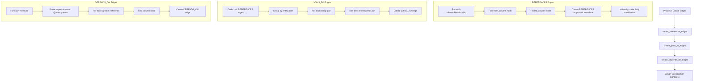

## REFERENCES → JOINS_TO Aggregation

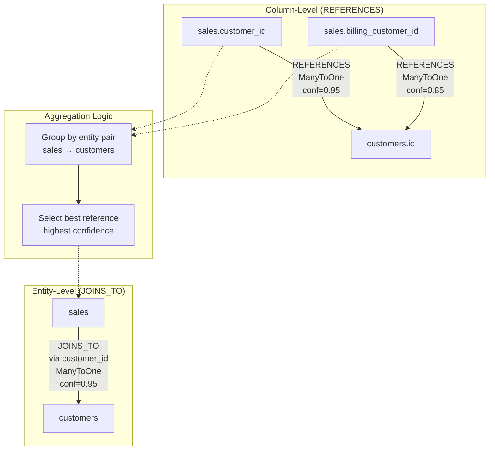

## Expression Parsing for DEPENDS_ON

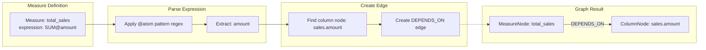

## Complete Graph Structure

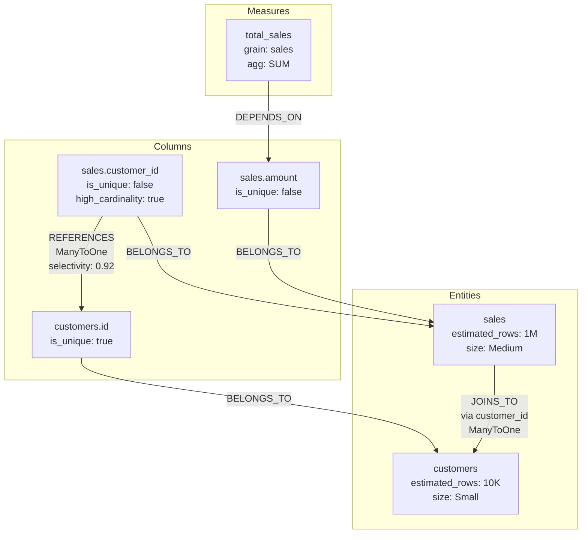
````

Expected: Clear visualization of edge creation logic

**Step 9: Commit diagram**

```bash
git add docs/diagrams/unified-graph-construction-phase2.md
git commit -m "docs(graph): add Phase 2 edge creation diagram"
```

---

## Task 4: Implement Query Interface (Entity-Level)

**Files:**
- Create: `src/semantic/graph/query.rs`
- Modify: `src/semantic/graph/mod.rs`

**Step 1: Add query module**

Add to `src/semantic/graph/mod.rs`:
```rust
pub mod query;
```

**Step 2: Create query.rs with error types**

Create `src/semantic/graph/query.rs`:
```rust
use super::types::*;
use super::UnifiedGraph;
use petgraph::Direction;
use std::collections::{HashMap, HashSet, VecDeque};
use petgraph::graph::{EdgeIndex, NodeIndex};

/// Query error
#[derive(Debug, thiserror::Error)]
pub enum QueryError {
    #[error("Entity not found: {0}")]
    EntityNotFound(String),
    
    #[error("Column not found: {0}")]
    ColumnNotFound(String),
    
    #[error("Measure not found: {0}")]
    MeasureNotFound(String),
    
    #[error("No path found from {from} to {to}")]
    NoPathFound { from: String, to: String },
    
    #[error("Unsafe path from {from} to {to}: {reason}")]
    UnsafePath { from: String, to: String, reason: String },
    
    #[error("Invalid node type: expected {expected}, got {actual}")]
    InvalidNodeType { expected: String, actual: String },
}

pub type QueryResult<T> = Result<T, QueryError>;

/// Join path between entities
#[derive(Debug, Clone)]
pub struct JoinPath {
    pub steps: Vec<JoinStep>,
}

/// Single step in a join path
#[derive(Debug, Clone)]
pub struct JoinStep {
    pub from_entity: String,
    pub to_entity: String,
    pub from_column: String,
    pub to_column: String,
    pub cardinality: String,
}
```

**Step 3: Implement find_path**

Add to `query.rs`:
```rust
impl UnifiedGraph {
    /// Find shortest join path between entities using BFS
    pub fn find_path(&self, from: &str, to: &str) -> QueryResult<JoinPath> {
        let from_idx = self.entities.get(from)
            .ok_or_else(|| QueryError::EntityNotFound(from.to_string()))?;
        let to_idx = self.entities.get(to)
            .ok_or_else(|| QueryError::EntityNotFound(to.to_string()))?;
        
        // BFS to find shortest path
        let mut queue = VecDeque::new();
        let mut visited = HashSet::new();
        let mut parent: HashMap<NodeIndex, (NodeIndex, EdgeIndex)> = HashMap::new();
        
        queue.push_back(*from_idx);
        visited.insert(*from_idx);
        
        while let Some(current_idx) = queue.pop_front() {
            if current_idx == *to_idx {
                return self.reconstruct_join_path(*from_idx, *to_idx, &parent);
            }
            
            // Explore JOINS_TO edges
            for edge_ref in self.graph.edges_directed(current_idx, Direction::Outgoing) {
                if matches!(edge_ref.weight(), GraphEdge::JoinsTo(_)) {
                    let next_idx = edge_ref.target();
                    if !visited.contains(&next_idx) {
                        visited.insert(next_idx);
                        parent.insert(next_idx, (current_idx, edge_ref.id()));
                        queue.push_back(next_idx);
                    }
                }
            }
        }
        
        Err(QueryError::NoPathFound {
            from: from.to_string(),
            to: to.to_string(),
        })
    }
    
    fn reconstruct_join_path(
        &self,
        from_idx: NodeIndex,
        to_idx: NodeIndex,
        parent: &HashMap<NodeIndex, (NodeIndex, EdgeIndex)>,
    ) -> QueryResult<JoinPath> {
        let mut steps = Vec::new();
        let mut current_idx = to_idx;
        
        while current_idx != from_idx {
            let (parent_idx, edge_idx) = parent.get(&current_idx)
                .ok_or_else(|| QueryError::NoPathFound {
                    from: "unknown".to_string(),
                    to: "unknown".to_string(),
                })?;
            
            if let GraphEdge::JoinsTo(join_edge) = &self.graph[*edge_idx] {
                let from_entity = if let GraphNode::Entity(e) = &self.graph[*parent_idx] {
                    e.name.clone()
                } else {
                    return Err(QueryError::InvalidNodeType {
                        expected: "Entity".to_string(),
                        actual: "Other".to_string(),
                    });
                };
                
                let to_entity = if let GraphNode::Entity(e) = &self.graph[current_idx] {
                    e.name.clone()
                } else {
                    return Err(QueryError::InvalidNodeType {
                        expected: "Entity".to_string(),
                        actual: "Other".to_string(),
                    });
                };
                
                steps.push(JoinStep {
                    from_entity,
                    to_entity,
                    from_column: join_edge.from_column_id.clone(),
                    to_column: join_edge.to_column_id.clone(),
                    cardinality: format!("{:?}", join_edge.cardinality),
                });
            }
            
            current_idx = *parent_idx;
        }
        
        steps.reverse();
        Ok(JoinPath { steps })
    }
}
```

**Step 4: Implement validate_safe_path**

Add to `query.rs`:
```rust
impl UnifiedGraph {
    /// Validate that path doesn't have dangerous fan-out
    pub fn validate_safe_path(&self, from: &str, to: &str) -> QueryResult<JoinPath> {
        let path = self.find_path(from, to)?;
        
        // Check each step for fan-out
        for step in &path.steps {
            // ManyToOne is safe in forward direction
            // OneToMany is dangerous (fan-out)
            if step.cardinality.contains("OneToMany") {
                return Err(QueryError::UnsafePath {
                    from: from.to_string(),
                    to: to.to_string(),
                    reason: format!("Fan-out at {} -> {}", step.from_entity, step.to_entity),
                });
            }
        }
        
        Ok(path)
    }
}
```

**Step 5: Implement infer_grain**

Add to `query.rs`:
```rust
impl UnifiedGraph {
    /// Infer the grain (finest entity) from a set of entities
    pub fn infer_grain(&self, entities: &[String]) -> Option<String> {
        if entities.is_empty() {
            return None;
        }
        
        let mut max_rows = 0u64;
        let mut grain_entity = None;
        
        for entity_name in entities {
            if let Some(&entity_idx) = self.entities.get(entity_name) {
                if let GraphNode::Entity(entity_node) = &self.graph[entity_idx] {
                    if let Some(rows) = entity_node.estimated_rows {
                        if rows > max_rows {
                            max_rows = rows;
                            grain_entity = Some(entity_name.clone());
                        }
                    }
                }
            }
        }
        
        grain_entity
    }
}
```

**Step 6: Compile to verify entity-level queries**

Run: `cargo check --lib`
Expected: SUCCESS

**Step 7: Write unit tests**

Add to `src/semantic/graph/tests.rs`:
```rust
#[test]
fn test_find_path() {
    use crate::semantic::inference::{InferredRelationship, RelationshipSource};
    use crate::model::Cardinality;
    
    let mut model = Model::default();
    
    // Create sales → customers → regions path
    let mut sales = Table::default();
    sales.source = "raw_sales".to_string();
    let mut customer_id = Atom::default();
    customer_id.column = "customer_id".to_string();
    sales.atoms.insert("customer_id".to_string(), customer_id);
    model.tables.insert("sales".to_string(), sales);
    
    let mut customers = Table::default();
    customers.source = "raw_customers".to_string();
    let mut id = Atom::default();
    id.column = "id".to_string();
    let mut region_id = Atom::default();
    region_id.column = "region_id".to_string();
    customers.atoms.insert("id".to_string(), id);
    customers.atoms.insert("region_id".to_string(), region_id);
    model.tables.insert("customers".to_string(), customers);
    
    let mut regions = Table::default();
    regions.source = "raw_regions".to_string();
    let mut region_id_atom = Atom::default();
    region_id_atom.column = "id".to_string();
    regions.atoms.insert("id".to_string(), region_id_atom);
    model.tables.insert("regions".to_string(), regions);
    
    let relationships = vec![
        InferredRelationship {
            from_table: "sales".to_string(),
            from_column: "customer_id".to_string(),
            to_table: "customers".to_string(),
            to_column: "id".to_string(),
            confidence: 0.95,
            cardinality: Cardinality::ManyToOne,
            source: RelationshipSource::Inferred,
        },
        InferredRelationship {
            from_table: "customers".to_string(),
            from_column: "region_id".to_string(),
            to_table: "regions".to_string(),
            to_column: "id".to_string(),
            confidence: 0.95,
            cardinality: Cardinality::ManyToOne,
            source: RelationshipSource::Inferred,
        },
    ];
    
    let graph = UnifiedGraph::from_model_with_inference(
        &model,
        &relationships,
        &HashMap::new(),
    ).unwrap();
    
    let path = graph.find_path("sales", "regions").unwrap();
    assert_eq!(path.steps.len(), 2);
    assert_eq!(path.steps[0].from_entity, "sales");
    assert_eq!(path.steps[0].to_entity, "customers");
    assert_eq!(path.steps[1].from_entity, "customers");
    assert_eq!(path.steps[1].to_entity, "regions");
}
```

**Step 8: Run tests**

Run: `cargo test --lib semantic::graph::tests::test_find_path`
Expected: PASS

**Step 9: Commit entity-level queries**

```bash
git add src/semantic/graph/
git commit -m "feat(graph): implement entity-level query interface (find_path, validate_safe_path, infer_grain)"
```

**Step 10: Create architecture diagram for query interface**

Create `docs/diagrams/unified-graph-query-interface.md`:

````markdown
# Unified Graph Query Interface

## Entity-Level Queries (find_path)

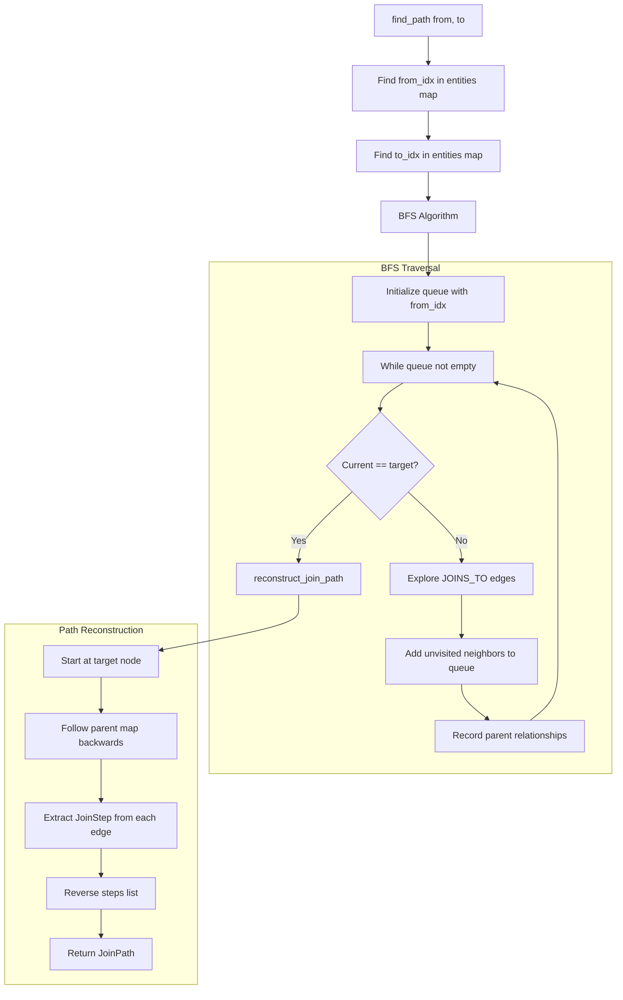

## Path Safety Validation

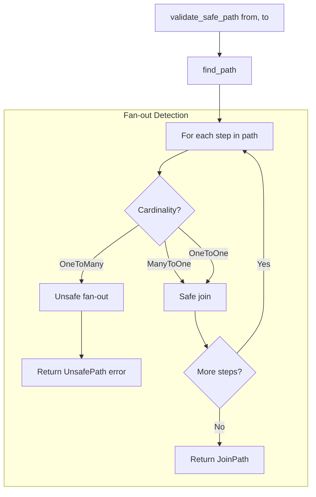

## Grain Inference

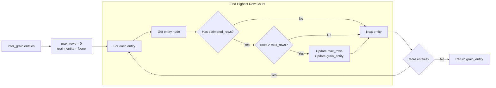

## Example: Finding Join Path

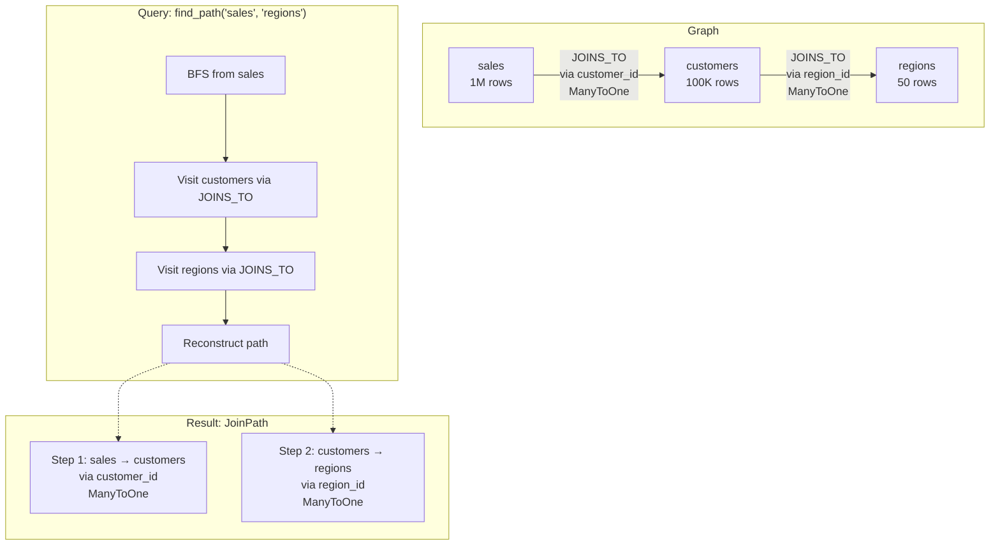
````

Expected: Clear visualization of query algorithms

**Step 11: Commit diagram**

```bash
git add docs/diagrams/unified-graph-query-interface.md
git commit -m "docs(graph): add query interface diagrams"
```

---

## Task 5: Implement Query Interface (Column-Level & Hybrid)

**Files:**
- Modify: `src/semantic/graph/query.rs`

**Step 1: Add ColumnRef type**

Add to top of `query.rs`:
```rust
/// Reference to a specific column
#[derive(Debug, Clone, PartialEq, Eq, Hash)]
pub struct ColumnRef {
    pub entity: String,
    pub column: String,
}
```

**Step 2: Implement required_columns**

Add to `query.rs`:
```rust
impl UnifiedGraph {
    /// Get all columns required to compute a measure
    pub fn required_columns(&self, measure_id: &str) -> QueryResult<HashSet<ColumnRef>> {
        let measure_idx = self.measures.get(measure_id)
            .ok_or_else(|| QueryError::MeasureNotFound(measure_id.to_string()))?;
        
        let mut required = HashSet::new();
        let mut visited = HashSet::new();
        let mut queue = VecDeque::new();
        
        queue.push_back(*measure_idx);
        visited.insert(*measure_idx);
        
        while let Some(current_idx) = queue.pop_front() {
            // Follow DEPENDS_ON edges
            for edge_ref in self.graph.edges_directed(current_idx, Direction::Outgoing) {
                if matches!(edge_ref.weight(), GraphEdge::DependsOn(_)) {
                    let target_idx = edge_ref.target();
                    
                    if let GraphNode::Column(col_node) = &self.graph[target_idx] {
                        // Extract entity name from column's entity_id
                        let entity_name = col_node.entity_id
                            .strip_prefix("entity:")
                            .unwrap_or(&col_node.entity_id)
                            .to_string();
                        
                        required.insert(ColumnRef {
                            entity: entity_name,
                            column: col_node.name.clone(),
                        });
                    }
                    
                    if !visited.contains(&target_idx) {
                        visited.insert(target_idx);
                        queue.push_back(target_idx);
                    }
                }
            }
        }
        
        Ok(required)
    }
}
```

**Step 3: Implement column_lineage**

Add to `query.rs`:
```rust
impl UnifiedGraph {
    /// Get lineage (dependencies) of a column
    pub fn column_lineage(&self, column_id: &str) -> QueryResult<Vec<ColumnRef>> {
        let column_idx = self.columns.get(column_id)
            .ok_or_else(|| QueryError::ColumnNotFound(column_id.to_string()))?;
        
        let mut lineage = Vec::new();
        let mut visited = HashSet::new();
        let mut queue = VecDeque::new();
        
        queue.push_back(*column_idx);
        visited.insert(*column_idx);
        
        while let Some(current_idx) = queue.pop_front() {
            // Follow DERIVED_FROM edges
            for edge_ref in self.graph.edges_directed(current_idx, Direction::Outgoing) {
                if matches!(edge_ref.weight(), GraphEdge::DerivedFrom(_)) {
                    let target_idx = edge_ref.target();
                    
                    if let GraphNode::Column(col_node) = &self.graph[target_idx] {
                        let entity_name = col_node.entity_id
                            .strip_prefix("entity:")
                            .unwrap_or(&col_node.entity_id)
                            .to_string();
                        
                        lineage.push(ColumnRef {
                            entity: entity_name,
                            column: col_node.name.clone(),
                        });
                    }
                    
                    if !visited.contains(&target_idx) {
                        visited.insert(target_idx);
                        queue.push_back(target_idx);
                    }
                }
            }
        }
        
        Ok(lineage)
    }
}
```

**Step 4: Implement column property checks**

Add to `query.rs`:
```rust
impl UnifiedGraph {
    /// Check if column is unique
    pub fn is_column_unique(&self, column_id: &str) -> QueryResult<bool> {
        let column_idx = self.columns.get(column_id)
            .ok_or_else(|| QueryError::ColumnNotFound(column_id.to_string()))?;
        
        if let GraphNode::Column(col_node) = &self.graph[*column_idx] {
            Ok(col_node.is_unique)
        } else {
            Err(QueryError::InvalidNodeType {
                expected: "Column".to_string(),
                actual: "Other".to_string(),
            })
        }
    }
    
    /// Check if column has high cardinality
    pub fn is_high_cardinality(&self, column_id: &str) -> QueryResult<bool> {
        let column_idx = self.columns.get(column_id)
            .ok_or_else(|| QueryError::ColumnNotFound(column_id.to_string()))?;
        
        if let GraphNode::Column(col_node) = &self.graph[*column_idx] {
            Ok(col_node.high_cardinality)
        } else {
            Err(QueryError::InvalidNodeType {
                expected: "Column".to_string(),
                actual: "Other".to_string(),
            })
        }
    }
}
```

**Step 5: Implement hybrid query methods**

Add to `query.rs`:
```rust
/// Join strategy recommendation
#[derive(Debug, Clone)]
pub struct JoinStrategy {
    pub steps: Vec<JoinStrategyStep>,
}

#[derive(Debug, Clone)]
pub struct JoinStrategyStep {
    pub from_entity: String,
    pub to_entity: String,
    pub join_hint: JoinHint,
}

#[derive(Debug, Clone)]
pub enum JoinHint {
    HashJoin { build_left: bool },
    Auto,
}

impl UnifiedGraph {
    /// Find path with required columns in one traversal
    pub fn find_path_with_required_columns(
        &self,
        from: &str,
        to: &str,
        measure_id: &str,
    ) -> QueryResult<(JoinPath, HashSet<ColumnRef>)> {
        let path = self.find_path(from, to)?;
        let columns = self.required_columns(measure_id)?;
        Ok((path, columns))
    }
    
    /// Determine best join strategy based on sizes
    pub fn find_best_join_strategy(&self, path: &JoinPath) -> JoinStrategy {
        let mut strategy = JoinStrategy { steps: Vec::new() };
        
        for step in &path.steps {
            let from_size = self.get_entity_size(&step.from_entity);
            let to_size = self.get_entity_size(&step.to_entity);
            
            let join_hint = match (from_size, to_size) {
                (Some(SizeCategory::Small) | Some(SizeCategory::Tiny),
                 Some(SizeCategory::Large) | Some(SizeCategory::Huge)) => {
                    JoinHint::HashJoin { build_left: true }
                }
                (Some(SizeCategory::Large) | Some(SizeCategory::Huge),
                 Some(SizeCategory::Small) | Some(SizeCategory::Tiny)) => {
                    JoinHint::HashJoin { build_left: false }
                }
                _ => JoinHint::Auto,
            };
            
            strategy.steps.push(JoinStrategyStep {
                from_entity: step.from_entity.clone(),
                to_entity: step.to_entity.clone(),
                join_hint,
            });
        }
        
        strategy
    }
    
    /// Check if aggregation should happen before join
    pub fn should_aggregate_before_join(
        &self,
        measure_id: &str,
        entity: &str,
    ) -> QueryResult<bool> {
        let measure_idx = self.measures.get(measure_id)
            .ok_or_else(|| QueryError::MeasureNotFound(measure_id.to_string()))?;
        
        if let GraphNode::Measure(measure_node) = &self.graph[*measure_idx] {
            let measure_grain_size = self.get_entity_size(&measure_node.grain_entity);
            let target_size = self.get_entity_size(entity);
            
            match (measure_grain_size, target_size) {
                (Some(grain_size), Some(target_size)) => {
                    Ok(grain_size as u8 > target_size as u8)
                }
                _ => Ok(false),
            }
        } else {
            Err(QueryError::InvalidNodeType {
                expected: "Measure".to_string(),
                actual: "Other".to_string(),
            })
        }
    }
    
    fn get_entity_size(&self, entity_name: &str) -> Option<SizeCategory> {
        self.entities.get(entity_name).and_then(|&idx| {
            if let GraphNode::Entity(entity_node) = &self.graph[idx] {
                entity_node.size_category
            } else {
                None
            }
        })
    }
}
```

**Step 6: Compile to verify all queries**

Run: `cargo check --lib`
Expected: SUCCESS

**Step 7: Commit column/hybrid queries**

```bash
git add src/semantic/graph/query.rs
git commit -m "feat(graph): implement column-level and hybrid query methods"
```

**Step 8: Create high-level system diagram**

Create `docs/diagrams/unified-graph-system-overview.md`:

````markdown
# Unified Graph System Overview

## Complete Data Flow

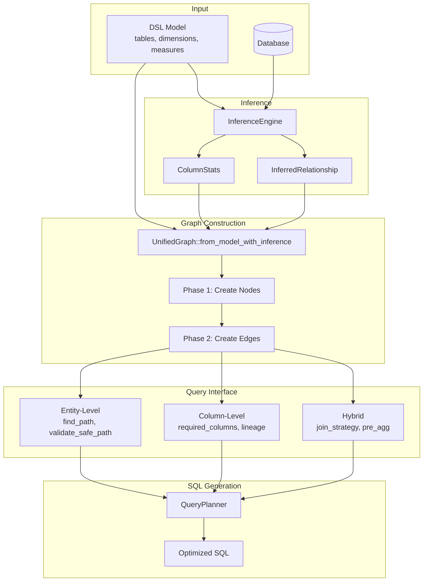

## Graph Capabilities

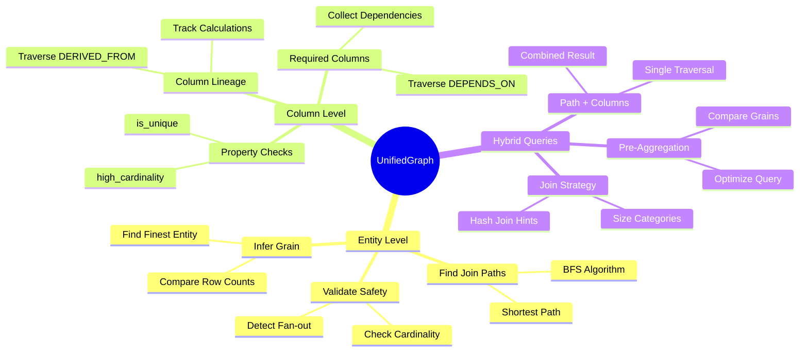

## Optimization Metadata Flow

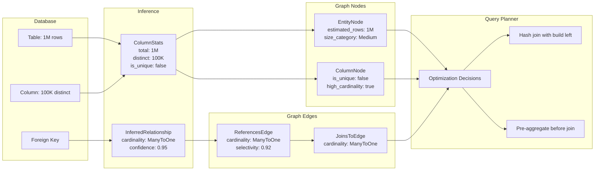
````

Expected: Comprehensive system overview

**Step 9: Commit system diagram**

```bash
git add docs/diagrams/unified-graph-system-overview.md
git commit -m "docs(graph): add complete system overview diagram"
```

---

## Task 6: Update QueryPlanner to Use UnifiedGraph

**Files:**
- Modify: `src/semantic/planner/mod.rs`
- Modify: `src/semantic/planner/resolve.rs`
- Modify: `src/semantic/planner/prune.rs`

**Step 1: Update QueryPlanner struct**

Read current QueryPlanner:
Run: Read `src/semantic/planner/mod.rs` lines 1-50

Then update the struct:
```rust
use crate::semantic::graph::UnifiedGraph;

pub struct QueryPlanner<'a> {
    graph: &'a UnifiedGraph,  // Changed from ModelGraph
    default_schema: String,
}

impl<'a> QueryPlanner<'a> {
    pub fn new(graph: &'a UnifiedGraph, default_schema: String) -> Self {
        Self {
            graph,
            default_schema,
        }
    }
}
```

**Step 2: Update resolve module**

Read `src/semantic/planner/resolve.rs` and update entity resolution to use UnifiedGraph's find_path method.

Replace calls to `self.graph.entity_graph` with `self.graph` (since entities are first-class nodes now).

**Step 3: Remove ColumnLineageGraph usage**

Read `src/semantic/planner/prune.rs` and update to use UnifiedGraph's required_columns method instead of ColumnLineageGraph.

Remove the optional `lineage` field from QueryPlanner since it's absorbed into UnifiedGraph.

**Step 4: Compile QueryPlanner**

Run: `cargo check --lib --package mantis_core`
Expected: May have errors - fix them iteratively

**Step 5: Fix compilation errors**

For each error:
- Read the file
- Update the method call to use UnifiedGraph API
- Re-compile

**Step 6: Run planner tests**

Run: `cargo test --lib semantic::planner`
Expected: PASS (or identify failing tests to update)

**Step 7: Commit QueryPlanner update**

```bash
git add src/semantic/planner/
git commit -m "feat(planner): update QueryPlanner to use UnifiedGraph"
```

---

## Task 7: Update Translation Layer to Build UnifiedGraph

**Files:**
- Modify: `src/translation/mod.rs`
- Create: `src/translation/graph_builder.rs`

**Step 1: Add graph construction helper**

Create `src/translation/graph_builder.rs`:
```rust
use crate::metadata::types::ColumnStats;
use crate::model::Model;
use crate::semantic::graph::{UnifiedGraph, GraphBuildResult};
use crate::semantic::inference::{InferenceEngine, InferredRelationship};
use std::collections::HashMap;

/// Build UnifiedGraph from Model with inference
pub async fn build_graph_from_model(
    model: &Model,
    inference_engine: &InferenceEngine,
) -> GraphBuildResult<UnifiedGraph> {
    // Run inference
    let relationships = inference_engine.infer_relationships(model).await?;
    let stats = inference_engine.collect_statistics(model).await?;
    
    // Build graph
    UnifiedGraph::from_model_with_inference(model, &relationships, &stats)
}
```

**Step 2: Update translate_report to require graph**

Update `src/translation/mod.rs`:
```rust
use crate::semantic::graph::UnifiedGraph;

/// Translate Report to SemanticQuery with graph context
pub fn translate_report(
    report: &Report,
    model: &Model,
    graph: &UnifiedGraph,
) -> Result<SemanticQuery, TranslationError> {
    // Now has access to graph for validation and optimization
    // ... existing translation logic ...
}
```

**Step 3: Update all translate_report call sites**

Search for usages:
Run: `rg "translate_report" --type rust`

Update each call site to pass UnifiedGraph reference.

**Step 4: Compile translation layer**

Run: `cargo check --lib`
Expected: May have errors in call sites

**Step 5: Fix call site errors**

For each error, update the call to pass the graph parameter.

**Step 6: Commit translation update**

```bash
git add src/translation/
git commit -m "feat(translation): integrate UnifiedGraph into translation layer"
```

---

## Task 8: Remove Old ModelGraph and ColumnLineageGraph

**Files:**
- Delete: `src/semantic/model_graph/` (entire directory)
- Delete: `src/semantic/column_lineage.rs`
- Modify: `src/semantic/mod.rs`

**Step 1: Check for remaining ModelGraph usages**

Run: `rg "ModelGraph" --type rust`

Update any remaining references to use UnifiedGraph.

**Step 2: Check for ColumnLineageGraph usages**

Run: `rg "ColumnLineageGraph" --type rust`

Update any remaining references to use UnifiedGraph's column methods.

**Step 3: Remove module declarations**

Update `src/semantic/mod.rs`:
```rust
// Remove these lines:
// pub mod model_graph;
// pub mod column_lineage;

// Keep:
pub mod graph;
```

**Step 4: Delete old files**

```bash
rm -rf src/semantic/model_graph
rm src/semantic/column_lineage.rs
```

**Step 5: Compile to verify clean removal**

Run: `cargo check --lib`
Expected: SUCCESS

**Step 6: Commit cleanup**

```bash
git add -A
git commit -m "refactor(semantic): remove old ModelGraph and ColumnLineageGraph"
```

---

## Task 9: Integration Testing

**Files:**
- Create: `src/semantic/graph/integration_tests.rs`

**Step 1: Write end-to-end test**

Create `src/semantic/graph/integration_tests.rs`:
```rust
#[cfg(test)]
mod integration_tests {
    use super::*;
    use crate::metadata::types::ColumnStats;
    use crate::model::{Model, Table, Atom, MeasureBlock, Measure};
    use crate::semantic::inference::{InferredRelationship, RelationshipSource};
    use crate::model::Cardinality;
    use std::collections::HashMap;
    
    fn create_test_model() -> Model {
        let mut model = Model::default();
        
        // Sales table
        let mut sales = Table::default();
        sales.source = "raw_sales".to_string();
        let mut customer_id = Atom::default();
        customer_id.column = "customer_id".to_string();
        let mut amount = Atom::default();
        amount.column = "amount".to_string();
        sales.atoms.insert("customer_id".to_string(), customer_id);
        sales.atoms.insert("amount".to_string(), amount);
        model.tables.insert("sales".to_string(), sales);
        
        // Customers table
        let mut customers = Table::default();
        customers.source = "raw_customers".to_string();
        let mut id = Atom::default();
        id.column = "id".to_string();
        customers.atoms.insert("id".to_string(), id);
        model.tables.insert("customers".to_string(), customers);
        
        // Measure
        let mut measure_block = MeasureBlock::default();
        let mut total_sales = Measure::default();
        total_sales.aggregation = "SUM".to_string();
        total_sales.expression = "@amount".to_string();
        measure_block.measures.insert("total".to_string(), total_sales);
        model.measures.insert("sales".to_string(), measure_block);
        
        model
    }
    
    fn create_test_relationships() -> Vec<InferredRelationship> {
        vec![
            InferredRelationship {
                from_table: "sales".to_string(),
                from_column: "customer_id".to_string(),
                to_table: "customers".to_string(),
                to_column: "id".to_string(),
                confidence: 0.95,
                cardinality: Cardinality::ManyToOne,
                source: RelationshipSource::Inferred,
            }
        ]
    }
    
    fn create_test_stats() -> HashMap<(String, String), ColumnStats> {
        let mut stats = HashMap::new();
        
        stats.insert(
            ("raw_sales".to_string(), "customer_id".to_string()),
            ColumnStats {
                total_count: 1_000_000,
                distinct_count: 50_000,
                null_count: 0,
                is_unique: false,
                sample_values: vec![],
            },
        );
        
        stats.insert(
            ("raw_customers".to_string(), "id".to_string()),
            ColumnStats {
                total_count: 50_000,
                distinct_count: 50_000,
                null_count: 0,
                is_unique: true,
                sample_values: vec![],
            },
        );
        
        stats
    }
    
    #[test]
    fn test_end_to_end_graph_construction() {
        let model = create_test_model();
        let relationships = create_test_relationships();
        let stats = create_test_stats();
        
        let graph = UnifiedGraph::from_model_with_inference(
            &model,
            &relationships,
            &stats,
        ).unwrap();
        
        // Verify entities
        assert_eq!(graph.entities.len(), 2);
        assert!(graph.entities.contains_key("sales"));
        assert!(graph.entities.contains_key("customers"));
        
        // Verify columns
        assert!(graph.columns.contains_key("column:sales:customer_id"));
        assert!(graph.columns.contains_key("column:customers:id"));
        
        // Verify measures
        assert!(graph.measures.contains_key("measure:sales:total"));
        
        // Test path finding
        let path = graph.find_path("sales", "customers").unwrap();
        assert_eq!(path.steps.len(), 1);
        assert_eq!(path.steps[0].from_entity, "sales");
        assert_eq!(path.steps[0].to_entity, "customers");
        
        // Test required columns
        let required = graph.required_columns("measure:sales:total").unwrap();
        assert_eq!(required.len(), 1);
        assert!(required.iter().any(|c| c.column == "amount"));
        
        // Test size categories
        let sales_size = graph.get_entity_size("sales");
        assert_eq!(sales_size, Some(SizeCategory::Medium));
    }
}
```

Add to `src/semantic/graph/mod.rs`:
```rust
#[cfg(test)]
mod integration_tests;
```

**Step 2: Run integration test**

Run: `cargo test --lib semantic::graph::integration_tests`
Expected: PASS

**Step 3: Commit integration tests**

```bash
git add src/semantic/graph/
git commit -m "test(graph): add end-to-end integration tests"
```

---

## Task 10: Create Final Documentation and Diagrams

**Files:**
- Create: `docs/architecture/unified-graph.md`
- Update: `README.md` or project docs

**Step 1: Write comprehensive architecture doc**

Create `docs/architecture/unified-graph.md`:
````markdown
# Unified Graph Architecture

## Overview

The Unified Graph is a column-level graph representation that replaces the old ModelGraph + ColumnLineageGraph split. It provides a single source of truth for:
- Entity relationships (join paths)
- Column dependencies (lineage, measure requirements)
- Optimization metadata (cardinality, selectivity, size categories)

## Design Principles

1. **Column-level graph**: Entities, columns, measures, calendars are all first-class nodes
2. **Typed edges**: BELONGS_TO, REFERENCES, DERIVED_FROM, DEPENDS_ON, JOINS_TO
3. **Construction-time inference**: Caller runs inference first, passes results to graph
4. **Separation of concerns**: Graph is pure data structure, query methods provide interface

## Node Types

See `docs/diagrams/unified-graph-types.md` for detailed class diagrams.

- **EntityNode**: Tables and dimensions with size metadata
- **ColumnNode**: Columns with uniqueness and cardinality flags
- **MeasureNode**: Aggregated metrics with grain information
- **CalendarNode**: Time dimensions

## Edge Types

- **BELONGS_TO**: Column → Entity (ownership)
- **REFERENCES**: Column → Column (FK with cardinality, selectivity, confidence)
- **DERIVED_FROM**: Column → Column (calculated column lineage)
- **DEPENDS_ON**: Measure → Column (measure requirements)
- **JOINS_TO**: Entity → Entity (aggregated relationships)

## Construction

See `docs/diagrams/unified-graph-construction-phase1.md` and `phase2.md` for flow diagrams.

```rust
// 1. Run inference
let relationships = inference_engine.infer_relationships(&model).await?;
let stats = inference_engine.collect_statistics(&model).await?;

// 2. Build graph
let graph = UnifiedGraph::from_model_with_inference(&model, &relationships, &stats)?;
```

## Query Interface

See `docs/diagrams/unified-graph-query-interface.md` for algorithm diagrams.

### Entity-Level
- `find_path(from, to)` - BFS shortest path
- `validate_safe_path(from, to)` - Fan-out detection
- `infer_grain(entities)` - Grain inference

### Column-Level
- `required_columns(measure_id)` - Dependency traversal
- `column_lineage(column_id)` - Lineage tracking
- `is_column_unique(column_id)` - Property checks

### Hybrid (The Power!)
- `find_path_with_required_columns(from, to, measure_id)` - Combined query
- `find_best_join_strategy(path)` - Size-based optimization
- `should_aggregate_before_join(measure_id, entity)` - Pre-aggregation logic

## Integration Points

- **QueryPlanner**: Uses graph for path finding and optimization
- **Translation Layer**: Builds graph from Model after parsing DSL
- **Inference Module**: Provides metadata for graph enrichment

## Migration from Old Architecture

Old:
```
ModelGraph (entity-level) + ColumnLineageGraph (column-level)
  ↓
QueryPlanner takes both graphs
  ↓
Can't do hybrid queries efficiently
```

New:
```
UnifiedGraph (column-level with entity aggregation)
  ↓
QueryPlanner takes single graph
  ↓
Hybrid queries are natural and efficient
```

## Troubleshooting

See architecture diagrams in `docs/diagrams/` for:
- Type system structure
- Construction flow (Phase 1 nodes, Phase 2 edges)
- Query algorithms
- System overview with data flow

Each diagram is generated from actual implemented code after each logical step.
````

**Step 2: Commit architecture doc**

```bash
git add docs/architecture/unified-graph.md
git commit -m "docs(graph): add comprehensive architecture documentation"
```

**Step 3: Create final system diagram**

After all code is working, create one final diagram showing the complete system in action.

Create `docs/diagrams/unified-graph-complete-example.md`:
````markdown
# Complete Example: Sales Analytics Query

## Scenario

User wants: "Show total sales by customer region"

```
Report:
  Table: sales
  Measures: [total_sales]
  Slicers: [customers.region]
```

## Graph Structure

```mermaid
graph TB
    subgraph "Entities"
        E1[sales<br/>1M rows<br/>Medium]
        E2[customers<br/>100K rows<br/>Small]
        E3[regions<br/>50 rows<br/>Tiny]
    end
    
    subgraph "Columns"
        C1[sales.customer_id<br/>high_cardinality]
        C2[sales.amount]
        C3[customers.id<br/>unique]
        C4[customers.region_id]
        C5[regions.id<br/>unique]
        C6[regions.name]
    end
    
    subgraph "Measures"
        M1[total_sales<br/>SUM@amount]
    end
    
    C1 -.BELONGS_TO.-> E1
    C2 -.BELONGS_TO.-> E1
    C3 -.BELONGS_TO.-> E2
    C4 -.BELONGS_TO.-> E2
    C5 -.BELONGS_TO.-> E3
    C6 -.BELONGS_TO.-> E3
    
    C1 -->|REFERENCES<br/>ManyToOne| C3
    C4 -->|REFERENCES<br/>ManyToOne| C5
    
    E1 -->|JOINS_TO| E2
    E2 -->|JOINS_TO| E3
    
    M1 -->|DEPENDS_ON| C2
```

## Query Planning Steps

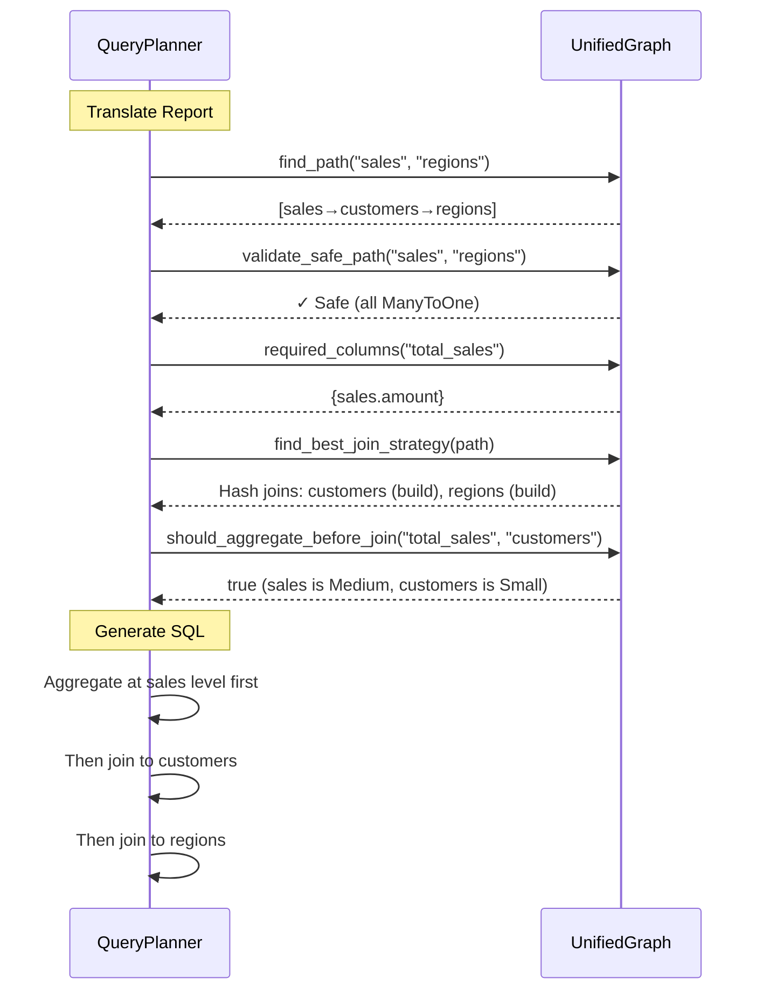

## Generated SQL (Optimized)

```sql
WITH sales_agg AS (
  -- Pre-aggregate at sales level (reduces 1M → 100K rows)
  SELECT
    customer_id,
    SUM(amount) as total_sales
  FROM raw_sales
  GROUP BY customer_id
)
SELECT
  r.name as region,
  SUM(s.total_sales) as total_sales
FROM sales_agg s
-- Hash join: build customers (100K rows, Small)
JOIN raw_customers c ON s.customer_id = c.id
-- Hash join: build regions (50 rows, Tiny)
JOIN raw_regions r ON c.region_id = r.id
GROUP BY r.name
```

## Optimization Decisions

| Decision | Based On | Metadata Used |
|----------|----------|---------------|
| Pre-aggregate sales | Sales (1M) > Customers (100K) | `estimated_rows`, `size_category` |
| Hash join (customers) | Customers smaller than sales | `size_category` |
| Hash join (regions) | Regions tiny | `size_category` |
| No subquery for measure | Only depends on sales.amount | `DEPENDS_ON` edges |
| Safe to aggregate | All joins are ManyToOne | `cardinality` on REFERENCES |
````

**Step 4: Commit example diagram**

```bash
git add docs/diagrams/unified-graph-complete-example.md
git commit -m "docs(graph): add complete worked example"
```

**Step 5: Final verification**

Run full test suite:
```bash
cargo test --lib
cargo test --doc
```

Expected: ALL PASS

**Step 6: Final commit**

```bash
git add -A
git commit -m "feat(semantic): complete unified graph rebuild

- Replaced ModelGraph + ColumnLineageGraph with UnifiedGraph
- Column-level graph with typed edges
- Integrated inference metadata at construction time
- Entity-level, column-level, and hybrid query methods
- Updated QueryPlanner and translation layer
- Comprehensive documentation and diagrams"
```

---

## Summary

This plan rebuilds the semantic layer graph from the ground up:

1. **Tasks 1-3**: Build UnifiedGraph (types, construction, Phase 1 nodes, Phase 2 edges)
2. **Tasks 4-5**: Implement query interface (entity, column, hybrid)
3. **Tasks 6-7**: Update consumers (QueryPlanner, translation layer)
4. **Task 8**: Clean up old code
5. **Tasks 9-10**: Test and document

**Key Features:**
- Single unified graph (no more split architecture)
- Column-level with entity aggregation
- Inference metadata wired in at construction
- Professional diagrams at each step for troubleshooting
- Clean break from old ModelGraph

**Execution:**
Use `superpowers:executing-plans` or `superpowers:subagent-driven-development` to implement task-by-task with review checkpoints.
